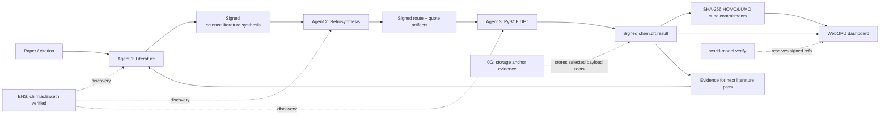
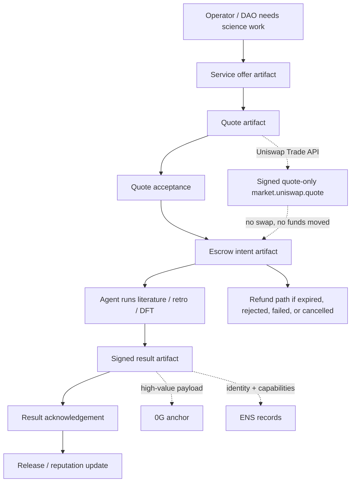

# Dashboard status

## Executive read

The current dashboard is `demo/world-map.html`. It prefers the live local projection `demo/world-model.live.json` when present and falls back to the static fixture `demo/world-model.json`. It remains a dependency-free submission surface for the focused ChimiaClaw pipeline:

Literature → Retrosynthesis → DFT

It deliberately excludes the broader lab-swarm, MSSP, World Avatar, discourse, KeeperHub, AXL, Uniswap, and extra sponsor clutter from the primary capture surface. Those ideas remain useful architecture, but the dashboard shown to judges should only claim what is implemented, evidenced, or explicitly marked as the next operator-gated action.

## Files and backups

- Current dashboard HTML: `demo/world-map.html`
- Static dashboard model: `demo/world-model.json`
- Live dashboard model, generated locally and ignored by git: `demo/world-model.live.json`
- Live model generator: `demo/live-dashboard-watch.py`
- Full pipeline producer: `demo/overnight-full-pipeline.sh`
- Focused three-agent source backup: `demo/.dashboard-backups/20260503-0300/`
- Broad dashboard backup preserved before restore: `demo/.dashboard-backups/20260503-0347-broad-before-three-agent-restore/`

The focused dashboard was restored from the `20260503-0300` backup because the live files had drifted back to the broad lab-swarm surface. The broad version is preserved for later architecture work but should not be used as the submission capture surface.

## Current model shape

The restored static model is intentionally small:

- 3 agent lanes
- 3 handoffs
- 3 agent-run cards
- 13 artifact/evidence cards plus a dedicated overnight DFT evidence card
- 1 central six-molecule WebGPU HOMO/LUMO orbital gallery with visible bond skeletons

The browser title is `ChimiaClaw Three-Agent Pipeline`. The topbar status stack shows schema, maturity, Literature, Retro, DFT, ENS, 0G, and the active source file. The main capture surface is now a compact one-page layout:

1. Agent pipeline on the left
2. WebGPU orbital gallery as the dominant hero panel on the right
3. Snapshot, evidence, handoffs, agent runs, artifacts, and agent details compressed into the lower page region

This is the right shape for a short judging pass because it gives one coherent story instead of forcing judges to parse every future architecture branch.

## Live refresh mode

The dashboard now supports local live mode for `demo/overnight-full-pipeline.sh`. The browser first tries `world-model.live.json`, then falls back to `world-model.json`, and repeats that fetch every five seconds with `cache: "no-store"`. This keeps the capture page updated while the operator-run pipeline emits new signed artifacts, without giving the browser wallet, API, or secret access.

The live model generator is:

```sh
python3 demo/live-dashboard-watch.py --once
```

For a standalone watcher:

```sh
python3 demo/live-dashboard-watch.py --watch --interval-seconds 5
```

`demo/overnight-full-pipeline.sh` calls the generator after startup, after each DFT result attempt, after each Uniswap quote attempt, after each 0G anchor attempt, after each ENS publish attempt, after `science-market-demo`, and after the final summary. The generated live model adds an `overnight_full_pipeline` block with counts and artifact IDs for DFT, Uniswap, 0G, and ENS outputs.

Boundary: live mode is still a local file projection. It reads artifacts already written under `demo/overnight-full-out/`; it does not invoke DFT, call Uniswap, publish ENS records, upload to 0G, read private keys, or move funds.

## Agent lane 1: Literature

Model id: `AGENT.LITERATURE`

Status: `operator-gated-next`

Role: search papers, extract cited reaction equations, identify candidate molecules, and sign the bridge artifact that downstream agents can consume.

Expected outputs:

- `science.literature.synthesis`
- `reaction_equation`
- `candidate_smiles`

Boundary: the Literature lane is not yet a completed live extraction claim. The dashboard should say it is the next signed run. The extraction artifact should include paper identifiers, citations, extracted reaction equations, confidence/uncertainty, and candidate molecule identifiers. It should not claim that the cited chemistry is true; it should claim only that ChimiaClaw extracted and signed a citation-bound candidate for downstream review.

Why this matters: Literature is the bridge between scientific text and executable agents. If it is framed as a bridge artifact, judges will understand why the project is practical even before a full literature backend is public.

## Agent lane 2: Retrosynthesis

Model id: `AGENT.RETROSYNTHESIS`

Status: `implemented-local-skill`

Role: take molecules from the curated library or literature output and run the existing RetroQuoter route/procurement flow.

Current outputs:

- `chem.retrosynth.route_proposal`
- `chem.procurement.route_quote`

Boundary: RetroQuoter is implemented and demonstrable, but the real ASKCOS/AiZynth-style expansion should remain clearly distinguished from deterministic demo routes unless its artifact is present. The dashboard should show Retro as implemented-local-skill, not as autonomous medicinal-chemistry intelligence.

Strongest next move: make the route proposal a child of a real `science.literature.synthesis` parent. That will give the dashboard a clean `paper → reaction candidate → route proposal` chain.

## Agent lane 3: DFT

Model id: `AGENT.DFT`

Status: `real-execution`

Role: run real PySCF calculations on curated molecules that do not already have signed DFT results, sign the outputs, and commit orbital cubes by SHA-256.

Current outputs:

- `chem.dft.result`
- `orbital_density_cube`
- HOMO/LUMO/total-density hashes

Evidence currently shown:

- Signed results: 14
- Cube files: 18
- Verified representative artifact: `art_b2b2171ec8afc316`
- Overnight scalar DFT artifacts: germane, methylgermane, cyclopropylgermane, adamantylgermane, germatrane

Boundary: DFT is the strongest scientific evidence in the project because real calculations exist. Keep the claim precise: PySCF calculations ran, results were signed, and cube files were content-addressed where cube generation was requested. Do not imply that every possible molecule has been computed, that scalar-only runs have cubes, or that all cubes are already on 0G.

## Overnight germanium DFT scalar test

The dashboard now includes the five-molecule overnight DFT run from `demo/overnight-science-out/dft/` as scalar evidence. These are real converged PySCF PBE/def2-svp single-point calculations with signed request/result pairs:

- germane: `art_72799a3871d01929`, gap 8.944 eV, |μ| 0.000 D
- methylgermane: `art_691b9179ea649f38`, gap 7.942 eV, |μ| 0.713 D
- cyclopropylgermane: `art_69972a470fe7966c`, gap 6.954 eV, |μ| 0.793 D
- adamantylgermane: `art_bb3490ecb173f082`, gap 6.336 eV, |μ| 0.962 D
- germatrane: `art_d1a3d12e5978be50`, gap 5.469 eV, |μ| 1.435 D

Boundary: this run requested total energy, HOMO/LUMO gap, and dipole only. It did not emit `orbital_densities[]`, HOMO/LUMO cube files, or total-density cube files. Therefore it is shown as scalar DFT evidence in the dashboard, not as five new WebGPU orbital tabs.

## WebGPU orbital gallery

The dashboard now puts a six-molecule interactive WebGPU HOMO/LUMO gallery at the center of the capture surface. It is built from committed cube files referenced by signed `chem.dft.result` artifacts.

Gallery asset: `demo/dft/orbitals/homo_lumo_gallery_3d.json`

Compatibility single-molecule asset: `demo/dft/orbitals/benzene_homo_lumo_3d.json`

Molecules shown:

- water
- methanol
- benzene
- propylene glycol
- caprylic acid
- capric acid

Each molecule has 5,200 sampled HOMO points, 5,200 sampled LUMO points, atom coordinates extracted from the cube header, and visible bond skeletons inferred from covalent-radii distance thresholds. The renderer uses WebGPU instanced orbital point sprites plus WebGPU bond quads, with no WebGL path.

The gallery is a browser-friendly visualization derived from the cube fields, not a replacement for the cube files or a full quantum chemistry viewer. The evidence source of truth remains the signed `chem.dft.result` artifacts and SHA-256 cube commitments.

This is the clearest WOW shot for the video: six rotating HOMO/LUMO fields tied back to signed PySCF evidence.

## Handoffs

### Literature → Retrosynthesis

Model id: `FLOW.LIT.RETRO.001`

Status: `operator-gated-next`

Meaning: Literature extraction signs cited reaction candidates and curated molecule outputs. Retrosynthesis consumes those signed outputs as parents rather than receiving loose strings.

### Retrosynthesis → DFT

Model id: `FLOW.RETRO.DFT.001`

Status: `active`

Meaning: Retro proposes target/precursor molecules. DFT receives only curated molecules that lack existing signed results.

### DFT → Literature

Model id: `FLOW.DFT.LIT.001`

Status: `active`

Meaning: DFT result artifacts and cube hashes can be cited back into later literature syntheses, giving extracted reaction candidates computed-evidence context.

This closed loop is the dashboard's best narrative asset: papers propose chemistry, retro plans it, DFT computes it, and computed evidence becomes part of future literature context.

## ENS evidence

Status: `live-sepolia-verified`

Network: Sepolia chain `11155111`

Block range: `10778688-10778692`

Live claim: root `chimiaclaw.eth` identity is published, resolved, and verified. The three signed artifacts are:

- Publication: `art_bcf73364c39fb152`
- Resolution: `art_bc5f74fa853df294`
- Verification: `art_1eb873d15595ba6e`

Records resolved: `5/5`

Mismatches: `0`

Boundary: this proves the root identity, not per-agent capability subnames. The next ENS step is to publish Literature, Retro, and DFT capability text records or subnames after the operator confirms the final content.

## 0G evidence

Status: `testnet-anchor`

Network: `0G Galileo Turbo`

Storage URI: `zg://0x064c41c425f74b52218f8d9eaf8cc04388d93721262746185f52c23eac13e7c7`

Current anchored path:

- Source artifact: `art_c6fb4314b4dc7ac7`
- Anchor artifact: `art_06b4ba819c6222bc`
- Anchored content: ferrocene MolADT source artifact

Boundary: this proves one real upload/anchor path. It does not prove that every literature artifact, route artifact, DFT result, or cube has been uploaded. The next 0G step is a small batch: one literature synthesis, one route proposal, one DFT result, and one representative cube.

## Literature backend evidence

Status: `operator-gated-next`

Input: Semantic Scholar/API paper search

Output: `science.literature.synthesis`

Boundary: private host details and credentials should stay out of the public dashboard. The public claim should be about the signed artifact produced, not about the machine that produced it.

## What the dashboard no longer shows as primary truth

The restored focused dashboard does not show these as primary capture panels:

- Four-node lab-swarm map
- Candidate/allied/unknown labs
- MSSP optimization genealogy
- World Avatar RDF projection
- Crucible discourse panels
- KeeperHub scheduling surface
- AXL transport surface
- Uniswap settlement surface
- Extra sponsor status boxes without fresh evidence

Those ideas are not deleted from the project. They are simply too broad for the current judging pass and create avoidable skepticism if shown before the three-agent pipeline is legible.

## Validation commands

Run these before recording or submitting:

```sh
python3 -m py_compile demo/live-dashboard-watch.py
python3 demo/live-dashboard-watch.py --once
python3 -m json.tool demo/world-model.json >/tmp/chimiaclaw-world-model.json
python3 -m json.tool demo/world-model.live.json >/tmp/chimiaclaw-world-model.live.json
python3 - <<'PY2'
from pathlib import Path
html = Path('demo/world-map.html').read_text()
start = html.index('<script>') + len('<script>')
end = html.index('</script>', start)
Path('/tmp/chimiaclaw-world-map-script.js').write_text(html[start:end])
PY2
node --check /tmp/chimiaclaw-world-map-script.js
cargo run -p chimiaclaw-cli -- world-model verify --world-model demo/world-model.json --artifact-dir demo
cargo run -p chimiaclaw-cli -- world-model verify --world-model demo/world-model.live.json --artifact-dir demo
```

Expected verifier shape for the focused static model: three agent lanes, three handoffs, three data flows, two concept flows, the six cube-backed orbital source artifacts, the representative B3LYP DFT artifact, and the five overnight germanium scalar DFT artifacts resolved under `demo/`. Expected live-model addition: `overnight_full_pipeline.counts` exists and any referenced live DFT, Uniswap, 0G, or ENS artifact IDs resolve recursively under `demo/`.

## Condensed diagrammatic cut

If the voiceover is the painful part, make the video mostly diagrams plus dashboard footage and keep narration to one sentence per screen. The cleanest explanation is two diagrams:





Minimal voiceover lines:

1. I am [name] from ChimiaDAO, a decentralized chemistry research project using decentralized collaboration and blockchain technology to make scientific work verifiable.
2. ChimiaClaw turns scientific agent work into a signed artifact DAG.
3. The live dashboard is only a projection; the signed artifacts are the source of truth.
4. Literature is the next citation-bound extraction run, RetroQuoter is implemented, and DFT has real PySCF results.
5. The WebGPU orbital viewer is derived from signed cube-backed DFT artifacts.
6. ENS proves agent identity, 0G proves storage anchoring, and Uniswap is quote-only settlement evidence.
7. The verifier resolves dashboard references back to signed artifacts.
8. The economic loop is quote, acceptance, escrow intent, result, acknowledgement, and release.
9. The closed scientific loop is paper to route to DFT to evidence for the next paper pass.

## Capture guidance

Target 2:25–3:05 including the 10-second personal/ChimiaDAO opener. Use `demo/world-map.html` as the primary footage; the two Mermaid diagrams above are framing material.

Recommended recording order:

1. 0:00–0:10 — Camera or title card: introduce yourself and ChimiaDAO as decentralized chemistry research.
2. 0:10–0:30 — Show the architecture diagram and state the artifact-DAG thesis.
3. 0:30–1:00 — Open `demo/world-map.html`, show the title, topbar, and source pill.
4. 1:00–1:25 — Walk the three lanes: Literature next, RetroQuoter implemented, DFT real execution.
5. 1:25–2:05 — Hero shot: switch through the WebGPU HOMO/LUMO molecule tabs and mention signed cube commitments.
6. 2:05–2:30 — Show DFT / ENS / 0G / Uniswap evidence cards with caveats: scalar-only DFT has no cubes, ENS root is live, 0G has proven anchors, Uniswap is quote-only.
7. 2:30–2:50 — Show `world-model verify` output or a terminal still.
8. 2:50–3:05 — Show the monetization diagram and close with the scientific loop plus paid service loop.

## Brutal dashboard critique

The dashboard is now coherent, but it still has two weak spots:

- Literature is not yet real evidence. If the first judge sees Literature as lane one but no signed extraction artifact exists, they may discount the pipeline as aspirational. Fix this first.
- ENS and 0G evidence are real but narrow. If the wording is sloppy, judges may think the dashboard is pretending every agent and payload is already decentralized. Keep the caveats visible.

The strongest current dashboard claim is DFT, now with a central six-molecule WebGPU HOMO/LUMO gallery plus a separate five-molecule overnight germanium scalar run. The strongest next improvement is one full paper-to-route-to-DFT artifact chain, even if the literature extraction is modest.
