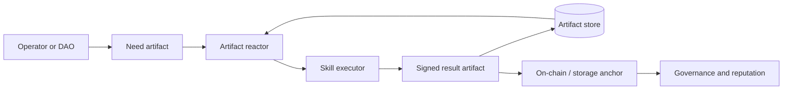

# chimiaclaw

Rust-native scaffold for autonomous scientific agents, signed payload-bound artifact DAGs, and a future ChimiaDAO governance runtime.

`chimiaclaw` treats every scientific action, agent decision, optimization step, procurement move, and governance event as a signed artifact in a directed acyclic graph that commits to its scientific or procurement payload. Today, this repository ships the artifact substrate plus two payload-bound demo flows and a contracts scaffold. Autonomous runtime and governance execution are planned, not yet present.

## Maturity at a glance

- **Implemented and tested:** `chimiaclaw-artifact` (signed artifacts with `PayloadRef` binding), `chimiaclaw-ord-adt` (ORD/ORD-like to ADT translator), `apps/retroquoter` (route → quote → procured receipt), CLI `demo-dag` and `demo-ord-adt` flows, Foundry scaffold tests.
- **Scaffolded (intentional placeholders, no autonomous behavior):** `chimiaclaw-skill`, `chimiaclaw-reactor`, `chimiaclaw-optimization`, `chimiaclaw-governance`, `chimiaclaw-mutator`, `chimiaclaw-node`, all `chimiaclaw-storage-0g` / `transport-axl` / `identity-ens` / `inft` / `onchain-pox` / `settle-uniswap` / `exec-keeperhub` / `semantic-rdf` adapters, `apps/dft-daemon`, `apps/marchev-mssp`.
- **Design-only (described, not built):** cross-machine consensus, governance execution, on-chain anchoring, MSSP/cybernetic Marchev stack, World Avatar RDF projection, real procurement APIs.

When this README says "DAO substrate" or "reference swarm", read it as direction, not present capability.

## What this repository is

This is an OpenAgents hackathon scaffold for what may eventually become the first practical ChimiaDAO agent runtime:

- A Rust workspace whose **only** currently-implemented agent surfaces are the artifact substrate and two deterministic skill flows (procurement, ORD→ADT).
- Placeholder crates for skills, reactor, optimization, governance, mutator, node, and the various adapters (0G, AXL, ENS, iNFT, PoX, Uniswap, KeeperHub, RDF).
- A working payload-bound signed artifact DAG smoke demo: route proposal → quote → procured receipt, where each artifact commits to its canonical payload digest.
- A working ORD→ADT bridge: ORD-like or official ORD JSON → minimal ADT experiment → signed child artifact.
- Solidity **scaffolding** for capability tokens, proposal anchoring, reputation, and governance — anchoring shape only, no quorum/vote semantics enforced yet.

## Core idea



The artifact DAG is the canonical state. On-chain contracts anchor high-value roots and capability/reputation state; decentralized storage and local stores hold the detailed scientific trace.

## Repository map

- `crates/chimiaclaw-schema`: typed identifiers, capabilities, schema tags, and strategy sets.
- `crates/chimiaclaw-artifact`: signed artifact model, local artifact store trait, DAG helpers.
- `crates/chimiaclaw-skill`: skill trait and registry.
- `crates/chimiaclaw-reactor`: pressure-scored artifact reactor.
- `crates/chimiaclaw-optimization`: population, fitness, crossover, tournament, and switcher traits.
- `crates/chimiaclaw-governance`: proposal/vote/execution artifact types.
- `crates/chimiaclaw-ord-adt`: ORD/ORD-like reaction JSON to ADT translation.
- `crates/chimiaclaw-node`: long-running daemon entrypoint.
- `crates/chimiaclaw-cli`: operator/developer CLI entrypoint.
- `apps/retroquoter`: deterministic route quote and procurement receipt engine.
- `apps/dft-daemon`: DFT swarm scaffold.
- `apps/marchev-mssp`: MSSP/cybernetic optimization scaffold.
- `contracts`: Solidity governance/capability/reputation scaffolding.
- `skills`: curated ScienceClaw-derived and ChimiaClaw-native skill notes.
- `docs`: architecture, decisions, next steps, and focused implementation notes.
- `demo`: scripts and instructions for local/multi-agent demonstrations.

## Working demos

Run the deterministic signed artifact DAG demo:

```sh
cargo run -p chimiaclaw-cli -- demo-dag
```

Run the ORD→ADT signed translation demo:

```sh
cargo run -p chimiaclaw-cli -- demo-ord-adt
```

## Validate

```sh
cargo fmt --all -- --check
cargo check --workspace
cargo test --workspace
forge test --root contracts
```

## Documentation

- `docs/ARCHITECTURE.md`: system architecture and artifact DAG diagrams.
- `docs/DECISIONS.md`: early architectural decisions and trade-offs.
- `docs/ORD_ADT.md`: ORD→ADT bridge behavior and ingestion shape.
- `docs/HACKATHON.md`: prize-facing scope and demo path.
- `docs/GOVERNANCE.md`: DAO substrate model.
- `docs/THOUGHTS.md`: working notes and design pressure.
- `docs/NEXT_STEPS.md`: prioritized build plan.

## DAO substrate direction

The long-term direction is for governance to be expressed as skill families (`gov.propose.*`, `gov.vote.*`, `gov.execute.*`) that emit artifacts, with an on-chain governor verifying anchored proposal CIDs and reputation-weighted votes. **None of that execution semantics is implemented yet.** Today, the repository contains contract scaffolding plus the artifact substrate that future governance flows will sit on. Treat "DAO substrate" as a direction the artifact DAG points at, not as a present feature.
