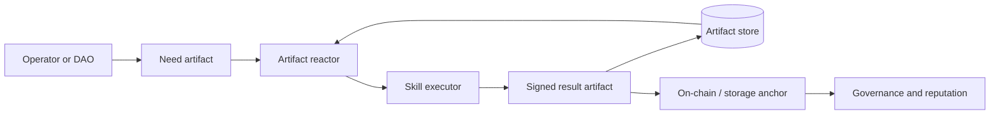

# ChimiaClaw

**Rust-native agent framework for decentralized science.** Every action — DFT computation, retrosynthesis, literature search, procurement, governance — is a signed, content-addressed artifact in a payload-bound DAG.

> Built for ETHGlobal OpenAgents · Apache-2.0 · [Architecture](docs/ARCHITECTURE.md) · [Live demo](demo/world-map.html)

## What makes this real

- **Signed artifact DAG** — Ed25519 signatures + Blake3 content hashing. Tamper with the payload, the signature breaks. Every artifact commits to its canonical bytes via `PayloadRef`.
- **Six real DFT results** — Water, methanol, benzene, propylene glycol, caprylic acid, capric acid. SCF-converged PBE/def2-tzvp on PySCF. HOMO/LUMO/total-density orbital cubes content-addressed via SHA-256. [View in SciCrucible →](SciCrucible_v1/)
- **Live ENS identity on Sepolia** — Agent text records published, resolved, and verified on-chain. Three signed artifacts: `identity.ens.publication` → `identity.ens.resolution` → `identity.ens.verification`. No hard-coded values.
- **Science service market** — Retrosynthesis, DFT, and literature service flows with full economic settlement: quote → acceptance → escrow → settlement intent → result → acknowledgement → release. Non-custodial by default.
- **Portable Molecular ADT** — 21-atom ferrocene with η5-haptic bonding systems down to water. Pure-Rust SVG renderer, XYZ/PySCF projections, RDKit worker boundary for arbitrary SMILES.
- **0G Storage adapter** — Signed `storage.zerog.upload` anchor artifacts with content-addressed payloads. Private keys never touch process arguments.
- **KeeperHub execution scheduling** — Rust REST client for workflow scheduling with signed `exec.keeperhub.*` artifacts.
- **Local polling runtime** — File-backed artifact store, skill registry, deterministic polling loop with idempotent child production.

## Quick start

```sh
cargo run -p chimiaclaw-cli -- demo-dag              # route → quote → receipt
cargo run -p chimiaclaw-cli -- science-market-demo    # three signed service flows
cargo run -p chimiaclaw-cli -- moladt-dft-demo        # ferrocene MolADT + DFT request
cargo run -p chimiaclaw-cli -- world-model verify     # preflight integrity check
python3 -m http.server 8787 --directory demo          # then open localhost:8787/world-map.html
```

## Validate

```sh
cargo fmt --all -- --check
cargo check --workspace
cargo test --workspace
cargo check --workspace --all-features
forge test --root contracts
```

---

## Detailed documentation

`chimiaclaw` treats every scientific action, agent decision, optimization step, procurement move, and governance event as a signed artifact in a directed acyclic graph that commits to its scientific or procurement payload. Today, this repository ships the artifact substrate, deterministic local polling over a file-backed store, payload-bound demo flows, a science service transaction fixture with artifact-native economic settlement, and a contracts scaffold. Cross-machine autonomy and governance execution are planned, not yet present.

## Maturity at a glance

- **Implemented and tested:** `chimiaclaw-artifact` (signed artifacts with `PayloadRef` binding, file-backed store), `chimiaclaw-moladt` (portable Molecular ADT, validation, XYZ/PySCF projections, signed `chem.molecule.adt` and `chem.dft.request` artifacts, curated SMILES→MoleculeAdt library), `chimiaclaw-ord-adt` (ORD/ORD-like to ADT translator + `OrdToAdtSkill` plus an ORD→MolADT bridge that explicitly skips multi-component salts and metal complexes), `chimiaclaw-market` (deterministic signed science service transactions for DFT, retrosynthesis, and literature, including a MolADT-backed DFT molecule artifact parented to the service request and the full quote acceptance, escrow authorization, result acknowledgement, simulated release, and refund policy artifacts), feature-gated ENS/0G/KeeperHub adapter surfaces (`identity.ens.*`, `storage.zerog.upload`, `exec.keeperhub.*` artifacts), `apps/retroquoter` (route → quote → procured receipt + `RouteQuoteSkill`), `chimiaclaw-node` minimal local polling runtime, CLI `demo-dag`, `demo-ord-adt`, `science-market-demo`, `moladt-dft-demo`, `ord-moladt-demo`, `node seed-ord`, `node seed-route`, `node run-once`, `node run`, `artifact inspect`, and `live ...` flows, Foundry scaffold tests.
- **Scaffolded (intentional placeholders, no autonomous behavior):** `chimiaclaw-skill` registry only, `chimiaclaw-reactor`, `chimiaclaw-optimization`, `chimiaclaw-governance`, `chimiaclaw-mutator`, `chimiaclaw-transport-axl` / `inft` / `onchain-pox` / `settle-uniswap` / `semantic-rdf` adapters, live DFT execution in `apps/dft-daemon`, `apps/marchev-mssp`.
- **Design-only (described, not built):** direct `chimiaclaw-node` daemon binary, cross-machine consensus, governance execution, on-chain anchoring, MSSP/cybernetic Marchev stack, World Avatar RDF projection, real procurement APIs.

When this README says "DAO substrate" or "reference swarm", read it as direction, not present capability.

## What this repository is

This is an OpenAgents hackathon scaffold for what may eventually become the first practical ChimiaDAO agent runtime:

- A Rust workspace whose **only** currently-implemented agent surfaces are the artifact substrate, a local file-backed polling loop, two deterministic skill flows (procurement, ORD→ADT), and deterministic science service transaction fixtures.
- Placeholder crates for skills, reactor, optimization, governance, mutator, node, and the still-shape-only adapters (AXL, iNFT, PoX, Uniswap, RDF), plus feature-gated ENS, 0G, and KeeperHub adapter surfaces.
- A working payload-bound signed artifact DAG smoke demo: route proposal → quote → procured receipt, where each artifact commits to its canonical payload digest.
- A working ORD→ADT bridge: ORD-like or official ORD JSON → minimal ADT experiment → signed child artifact.
- A working local science transaction fixture: ENS-shaped provider profile → service offer → request → quote → quote acceptance → simulated escrow authorization → operator-confirmation-required settlement intent → result → result acknowledgement → simulated release, for DFT, retrosynthesis, and literature.
- A static frontend world-model fixture for the lab-swarm / “agentic kingdom” map, grounded in current artifact flows rather than a live backend API, with four real ChimiaDAO nodes visibly exchanging data and MSSP / World Avatar concepts.
- Solidity **scaffolding** for capability tokens, proposal anchoring, reputation, and governance — anchoring shape only, no quorum/vote semantics enforced yet.

## Core idea



The artifact DAG is the canonical state. On-chain contracts anchor high-value roots and capability/reputation state; decentralized storage and local stores hold the detailed scientific trace.

## Repository map

- `crates/chimiaclaw-schema`: typed identifiers, capabilities, schema tags, and strategy sets.
- `crates/chimiaclaw-artifact`: signed artifact model, local artifact store trait, DAG helpers.
- `crates/chimiaclaw-skill`: skill trait and registry.
- `crates/chimiaclaw-reactor`: pressure-scored artifact reactor.
- `crates/chimiaclaw-optimization`: population, fitness, crossover, tournament, and switcher traits.
- `crates/chimiaclaw-governance`: proposal/vote/execution artifact types.
- `crates/chimiaclaw-market`: science service market primitives and deterministic signed DFT/retrosynthesis/literature transaction fixtures.
- `crates/chimiaclaw-moladt`: portable Molecular ADT (mirrored from `MolADT-Bayes`) used as the canonical molecule substrate for DFT requests, with validation, XYZ/PySCF projections, and signed `chem.molecule.adt` / `chem.dft.request` artifacts.
- `crates/chimiaclaw-ord-adt`: ORD/ORD-like reaction JSON to ADT translation.
- `crates/chimiaclaw-node`: minimal local runtime over the file-backed artifact store; the direct daemon binary is still scaffolded.
- `crates/chimiaclaw-cli`: operator/developer CLI entrypoint.
- `apps/retroquoter`: deterministic route quote and procurement receipt engine.
- `apps/dft-daemon`: DFT swarm scaffold.
- `apps/marchev-mssp`: MSSP/cybernetic optimization scaffold.
- `contracts`: Solidity governance/capability/reputation scaffolding.
- `skills`: curated ScienceClaw-derived and ChimiaClaw-native skill notes.
- `docs`: architecture, decisions, next steps, and focused implementation notes.
- `demo`: scripts and instructions for local/multi-agent demonstrations.

## Working demos

Run the deterministic signed artifact DAG demo:

```sh
cargo run -p chimiaclaw-cli -- demo-dag
```

Run the ORD→ADT signed translation demo:

```sh
cargo run -p chimiaclaw-cli -- demo-ord-adt
```

Print the deterministic frontend world model:

```sh
cargo run -p chimiaclaw-cli -- world-model
```

Print the deterministic science service market transaction bundle:

```sh
cargo run -p chimiaclaw-cli -- science-market-demo
```

This emits three signed payload-bound artifact chains for ENS-shaped DFT, retrosynthesis, and literature providers. The DFT chain now uses a canonical MolADT molecule artifact (`chem.molecule.adt`) as an explicit parent of the service request, replacing raw SMILES as the source of truth, and the request input carries a `DftMoleculeRef` bound to the molecule artifact id and payload hash. Each chain includes the economic settlement lifecycle: the operator accepts the quote, authorizes a simulated artifact-ledger escrow, receives the result, acknowledges it, and emits a simulated release to the provider. It does not resolve live ENS records, send AXL traffic, store payloads on 0G, request live Uniswap quotes, schedule KeeperHub jobs, or move funds.

Print a standalone signed MolADT molecule and DFT request:

```sh
cargo run -p chimiaclaw-cli -- moladt-dft-demo
```

This emits a deterministic ferrocene `MoleculeAdt`, its XYZ and PySCF atom-block projections, the signed `chem.molecule.adt` artifact, and a signed `chem.dft.request` artifact whose method is the deep-learned Skala 1.1 functional with a `def2-tzvp` basis and a `CHIMIACLAW_DFT_COMMAND` worker hint. It is the canonical hand-off shape for the future Skala/PySCF DFT worker on `duck@olympus.local`.

Translate every substrate of an ORD reaction into signed MolADT artifacts:

```sh
cargo run -p chimiaclaw-cli -- ord-moladt-demo
cargo run -p chimiaclaw-cli -- ord-moladt-demo --official-ord-json /path/to/reaction.json
cargo run -p chimiaclaw-cli -- ord-moladt-demo --output-dir /tmp/ord-moladt
```

Without flags, this resolves the demo Suzuki ORD-like reaction's substrates against the curated `chimiaclaw-moladt` library (water, bromobenzene, phenylboronic acid, biphenyl, toluene, methanol, ethanol, acetic acid, ammonia, benzene), emits one signed `chem.molecule.adt` artifact per resolved substrate, and reports the rest in `skipped[]` with an explicit reason (`NotInLibrary` or `UnsafeForDirectDft`). Multi-component salts and transition-metal complexes are flagged rather than mis-translated, so the wrapper boundary for a real Skala/PySCF DFT worker can refuse them or route them through an external geometry pre-pass. With `--output-dir`, the command also writes one `.xyz` (deterministic XYZ block from `MoleculeAdt::write_xyz_to`) and one `.svg` (pure-Rust CPK depiction from `chimiaclaw_moladt::render`) per resolved substrate so they can be inspected visually before being handed to a DFT or rendering downstream.

Render any curated MolADT (or any SMILES the worker can resolve) directly:

```sh
cargo run -p chimiaclaw-cli -- moladt-render --library ferrocene --xyz /tmp/ferrocene.xyz --svg /tmp/ferrocene.svg
cargo run -p chimiaclaw-cli -- moladt-render --smiles 'Cc1ccccc1' --svg /tmp/toluene.svg
```

`moladt-render` resolves a curated library entry by name (`water`, `ammonia`, `methanol`, `ethanol`, `acetic-acid`, `benzene`, `toluene`, `bromobenzene`, `phenylboronic-acid`, `biphenyl`, `ferrocene`) or, with `--smiles`, falls through the curated library to the optional external SMILES worker (see below); it then writes XYZ and a pure-Rust SVG to disk and prints a JSON summary. There is also a pure-Rust covalent-radii geometry guesser at `chimiaclaw_moladt::geometry::guess_coordinates` for connectivity-only molecules that need a quick sanity-check geometry without an external chemistry stack.

A pre-rendered gallery of every curated entry plus seven worker-tier targets (benzaldehyde, aspirin, salicylic acid, pyridine, methylamine, imidazole, acetone) lives in `demo/molecules/` so the curated vs. RDKit-tier story is visible without running anything; see `demo/molecules/README.md`. The RDKit round-trip has been verified end to end: `O=Cc1ccccc1` produces a 14-atom MolADT with `provenance.source_kind = "rdkit-etkdgv3-mmff94"`.

## Worker boundaries (uv-managed, no Docker)

Two external Python skills attach behind environment-variable boundaries; both live under `skills/scienceclaw-port/workers/` and are intentionally fresh re-implementations of the upstream ScienceClaw skills (not literal vendoring).

SMILES → MolADT (RDKit ETKDGv3 + MMFF94, UFF fallback):

```sh
export CHIMIACLAW_SMILES_TO_MOLADT_COMMAND="uvx --from skills/scienceclaw-port/workers/cheminformatics rdkit-smiles-to-moladt"
cargo run -p chimiaclaw-cli -- moladt-render --smiles 'O=Cc1ccccc1' --xyz /tmp/benzaldehyde.xyz --svg /tmp/benzaldehyde.svg
```

ASKCOS retrosynthesis template-relevance (user-managed endpoint, no Docker fallback, no scraper):

```sh
export CHIMIACLAW_ASKCOS_ENDPOINT="http://duck.olympus.local:9410"
export CHIMIACLAW_ASKCOS_COMMAND="uvx --from skills/scienceclaw-port/workers/retrosynth askcos-retro"
# Optional cache override; defaults to ~/.cache/chimiaclaw/askcos.
export CHIMIACLAW_ASKCOS_CACHE_DIR="$HOME/.cache/chimiaclaw/askcos"
```

The Rust crate `chimiaclaw-retrosynth-askcos` runs that worker and signs the response as a `chem.retrosynth.template_suggestions` artifact, which `apps/retroquoter` can then attach as the parent of its existing route-quote artifacts. The crate refuses to invoke ASKCOS unless the env var is configured, and rejects empty/wrongly-tagged worker output rather than fabricating routes. The worker also carries a content-hashed disk cache (see `skills/scienceclaw-port/workers/retrosynth/README.md`); cache hits are recorded in the signed artifact via the optional `AskcosCacheRecord` field.

ENS write-side publication (web3.py + ens.set_text, idempotent, mainnet-refusing):

```sh
export CHIMIACLAW_ENS_PUBLISH_COMMAND="uv run --project skills/scienceclaw-port/workers/identity-ens ens-publish-text-records"
export ENS_WRITE_RPC_URL="https://sepolia.infura.io/v3/..."
export ENS_WRITE_PRIVATE_KEY="0x..."  # never passed on argv
```

The worker reads the private key from the environment, refuses chain id 1 unless `--allow-mainnet` is set, refuses to publish if the configured account is not the registry owner, and skips records whose current value already matches (idempotent re-runs). The Rust crate `chimiaclaw-identity-ens` consumes the worker output and signs an `identity.ens.publication` artifact, optionally chained with the existing read-side resolver + verifier into a three-artifact round-trip via `live ens-publish` (see `demo/ens-roundtrip.sh`).

0G upload wrapper (real binary or deterministic stub):

```sh
export ZEROG_UPLOAD_COMMAND="uv run --project skills/scienceclaw-port/workers/storage-0g zerog-upload"
export ZEROG_PRIVATE_KEY="0x..."
# Optional stub mode for CI/demos: skips network and emits a Blake2b-hashed receipt
export ZEROG_STUB=1
```

The worker shells out to `${ZEROG_BINARY:-0g-storage-client}` for the real upload and parses root/tx hashes from its stdout. With `ZEROG_STUB=1` it skips the network entirely, hashes the file with Blake2b-32, and emits a deterministic receipt with explicit `STUB MODE` audit notes — useful for CI and demos without ever silently impersonating a real on-chain anchor. End-to-end stub run: `demo/zerog-roundtrip.sh`.

KeeperHub workflow runbook (no Python worker; existing Rust REST client):

```sh
export KEEPERHUB_API_KEY="..."
export KEEPERHUB_BASE_URL="https://app.keeperhub.io"
```

`demo/keeperhub/workflow.json` is a reference manual-trigger workflow that takes `artifact_id`, `payload_hash`, and `mode` as inputs and emits a log step plus a zero-value transaction step. `demo/keeperhub/README.md` is the operator runbook for registering it and chaining DFT request → KeeperHub schedule → 0G anchor through `live keeperhub-schedule` and `live keeperhub-status`.

DFT execution (PySCF + Skala-1.1-fallback uv worker, real signed results):

```sh
export CHIMIACLAW_DFT_COMMAND="ssh duck@olympus.local /Users/duck/.local/bin/uv run --project /Users/duck/Documents/ChimiaDAO-QM/DFT/skills/scienceclaw-port/workers/dft chimiaclaw-dft --backend pyscf-classical"
```

The worker reads a `{request, molecule_adt, cube_grid?}` JSON wrapper on stdin, runs a real PySCF SCF (RKS for closed-shell, UKS otherwise), optionally generates HOMO/LUMO/total-density cubes via `pyscf.tools.cubegen`, and writes a `chem.dft.result` JSON document on stdout. The Rust adapter `chimiaclaw-dft-skala` signs the result as a payload-bound artifact parented to the `chem.dft.request` artifact, refusing to sign if `convergence.converged = false` or the schema tag is wrong. Cube bytes are materialized locally by the CLI, re-hashed with SHA-256, and committed into the signed artifact via `orbital_densities[]` (label + sha256 + grid resolution + local path; bytes are NOT inlined). The `--backend pyscf-skala` flag is wired but currently falls back to PBE with a tagged provenance note until the duck-side agent installs Skala 1.1 weights.

A six-molecule gallery (water, methanol, benzene, propylene glycol, caprylic acid C8, capric acid C10) is shipped at `demo/dft/`; each result has the full MolADT → DftRequest → DftResult lineage plus three `.cube` files (HOMO/LUMO/total density) under `demo/dft/cubes/`. See `demo/dft/README.md`.

Serve the static lab-swarm map:

```sh
python3 -m http.server 8787 --directory demo
```
Then open `http://localhost:8787/world-map.html`. The map marks the four real
ChimiaDAO nodes, shows active lab-to-lab interaction lines for every node in the
fixture, separates data payload movement from conceptual MSSP / World Avatar
sharing, and keeps candidate, virtual, and quarantined endpoints explicitly
bounded.

Run the file-backed node runtime end-to-end for ORD→ADT:

```sh
STORE=$(mktemp -d /tmp/chimiaclaw-store-XXXXXX)
cargo run -p chimiaclaw-cli -- node seed-ord --store-dir "$STORE"
cargo run -p chimiaclaw-cli -- node run-once --store-dir "$STORE"
cargo run -p chimiaclaw-cli -- artifact inspect --store-dir "$STORE"
```

This seeds a payload-bound `chem.ord.reaction` artifact, runs one synchronous
loop that invokes the registered `OrdToAdtSkill`, persists the verified
`chem.adt.reaction` child, and prints the resulting lineage.

Run both deterministic local skills through the polling loop:

```sh
STORE=$(mktemp -d /tmp/chimiaclaw-store-XXXXXX)
cargo run -p chimiaclaw-cli -- node seed-ord --store-dir "$STORE"
cargo run -p chimiaclaw-cli -- node seed-route --store-dir "$STORE"
cargo run -p chimiaclaw-cli -- node run --store-dir "$STORE" --max-cycles 3 --interval-ms 1000
cargo run -p chimiaclaw-cli -- artifact inspect --store-dir "$STORE"
```

`node run` emits one JSON object per polling cycle. Without `--max-cycles`, it
keeps polling until interrupted. Repeated cycles are idempotent: once a parent
artifact already has a child produced by a given skill, later cycles skip it
instead of creating timestamp-only duplicates.

## Live sponsor adapters

The first ENS, 0G Storage, and KeeperHub surfaces are implemented behind the
`live-sponsors` feature flag. The default commands above remain offline and
deterministic.

```sh
cargo run -p chimiaclaw-cli --features live-sponsors -- live ens-verify --agent dft.service.chimiaclaw.eth --ens dft.service.chimiaclaw.eth
cargo run -p chimiaclaw-cli --features live-sponsors -- live zerog-anchor --source-artifact-json /tmp/source-artifact.json --payload-file /tmp/payload.json
cargo run -p chimiaclaw-cli --features live-sponsors -- live keeperhub-schedule --workflow-id wf_... --input-json '{"artifact_id":"art_demo"}'
```

See `docs/speedrun/INTEGRATIONS.md` for required environment variables,
testnet assumptions, and the 0G wrapper boundary that keeps private keys out of
process arguments.

## Validate

```sh
cargo fmt --all -- --check
cargo check --workspace
cargo test --workspace
cargo check --workspace --all-features
forge test --root contracts
```

## Documentation

- `docs/ARCHITECTURE.md`: system architecture and artifact DAG diagrams.
- `docs/DECISIONS.md`: early architectural decisions and trade-offs.
- `docs/ORD_ADT.md`: ORD→ADT bridge behavior and ingestion shape.
- `docs/WORLD_MODEL.md`: frontend lab-swarm model and backend mapping.
- `docs/HACKATHON.md`: prize-facing scope and demo path.
- `docs/GOVERNANCE.md`: DAO substrate model.
- `docs/THOUGHTS.md`: working notes and design pressure.
- `docs/NEXT_STEPS.md`: prioritized build plan.

## DAO substrate direction

The long-term direction is for governance to be expressed as skill families (`gov.propose.*`, `gov.vote.*`, `gov.execute.*`) that emit artifacts, with an on-chain governor verifying anchored proposal CIDs and reputation-weighted votes. **None of that execution semantics is implemented yet.** Today, the repository contains contract scaffolding plus the artifact substrate that future governance flows will sit on. Treat "DAO substrate" as a direction the artifact DAG points at, not as a present feature.
