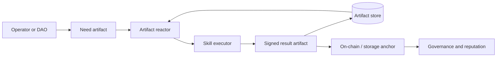

# chimiaclaw

Rust-native scaffold for autonomous scientific agents, signed payload-bound artifact DAGs, and a future ChimiaDAO governance runtime.

`chimiaclaw` treats every scientific action, agent decision, optimization step, procurement move, and governance event as a signed artifact in a directed acyclic graph that commits to its scientific or procurement payload. Today, this repository ships the artifact substrate, deterministic local polling over a file-backed store, payload-bound demo flows, a science service transaction fixture with artifact-native economic settlement, and a contracts scaffold. Cross-machine autonomy and governance execution are planned, not yet present.

## Maturity at a glance

- **Implemented and tested:** `chimiaclaw-artifact` (signed artifacts with `PayloadRef` binding, file-backed store), `chimiaclaw-ord-adt` (ORD/ORD-like to ADT translator + `OrdToAdtSkill`), `chimiaclaw-market` (deterministic signed science service transactions for DFT, retrosynthesis, and literature, including quote acceptance, escrow authorization, result acknowledgement, simulated release, and refund policy artifacts), `apps/retroquoter` (route → quote → procured receipt + `RouteQuoteSkill`), `chimiaclaw-node` minimal local polling runtime, CLI `demo-dag`, `demo-ord-adt`, `science-market-demo`, `node seed-ord`, `node seed-route`, `node run-once`, `node run`, and `artifact inspect` flows, Foundry scaffold tests.
- **Scaffolded (intentional placeholders, no autonomous behavior):** `chimiaclaw-skill` registry only, `chimiaclaw-reactor`, `chimiaclaw-optimization`, `chimiaclaw-governance`, `chimiaclaw-mutator`, all `chimiaclaw-storage-0g` / `transport-axl` / `identity-ens` / `inft` / `onchain-pox` / `settle-uniswap` / `exec-keeperhub` / `semantic-rdf` adapters, live DFT execution in `apps/dft-daemon`, `apps/marchev-mssp`.
- **Design-only (described, not built):** direct `chimiaclaw-node` daemon binary, cross-machine consensus, governance execution, on-chain anchoring, MSSP/cybernetic Marchev stack, World Avatar RDF projection, real procurement APIs.

When this README says "DAO substrate" or "reference swarm", read it as direction, not present capability.

## What this repository is

This is an OpenAgents hackathon scaffold for what may eventually become the first practical ChimiaDAO agent runtime:

- A Rust workspace whose **only** currently-implemented agent surfaces are the artifact substrate, a local file-backed polling loop, two deterministic skill flows (procurement, ORD→ADT), and deterministic science service transaction fixtures.
- Placeholder crates for skills, reactor, optimization, governance, mutator, node, and the various adapters (0G, AXL, ENS, iNFT, PoX, Uniswap, KeeperHub, RDF).
- A working payload-bound signed artifact DAG smoke demo: route proposal → quote → procured receipt, where each artifact commits to its canonical payload digest.
- A working ORD→ADT bridge: ORD-like or official ORD JSON → minimal ADT experiment → signed child artifact.
- A working local science transaction fixture: ENS-shaped provider profile → service offer → request → quote → quote acceptance → simulated escrow authorization → operator-confirmation-required settlement intent → result → result acknowledgement → simulated release, for DFT, retrosynthesis, and literature.
- A static frontend world-model fixture for the lab-swarm / “agentic kingdom” map, grounded in current artifact flows rather than a live backend API.
- Solidity **scaffolding** for capability tokens, proposal anchoring, reputation, and governance — anchoring shape only, no quorum/vote semantics enforced yet.

## Core idea



The artifact DAG is the canonical state. On-chain contracts anchor high-value roots and capability/reputation state; decentralized storage and local stores hold the detailed scientific trace.

## Repository map

- `crates/chimiaclaw-schema`: typed identifiers, capabilities, schema tags, and strategy sets.
- `crates/chimiaclaw-artifact`: signed artifact model, local artifact store trait, DAG helpers.
- `crates/chimiaclaw-skill`: skill trait and registry.
- `crates/chimiaclaw-reactor`: pressure-scored artifact reactor.
- `crates/chimiaclaw-optimization`: population, fitness, crossover, tournament, and switcher traits.
- `crates/chimiaclaw-governance`: proposal/vote/execution artifact types.
- `crates/chimiaclaw-market`: science service market primitives and deterministic signed DFT/retrosynthesis/literature transaction fixtures.
- `crates/chimiaclaw-ord-adt`: ORD/ORD-like reaction JSON to ADT translation.
- `crates/chimiaclaw-node`: minimal local runtime over the file-backed artifact store; the direct daemon binary is still scaffolded.
- `crates/chimiaclaw-cli`: operator/developer CLI entrypoint.
- `apps/retroquoter`: deterministic route quote and procurement receipt engine.
- `apps/dft-daemon`: DFT swarm scaffold.
- `apps/marchev-mssp`: MSSP/cybernetic optimization scaffold.
- `contracts`: Solidity governance/capability/reputation scaffolding.
- `skills`: curated ScienceClaw-derived and ChimiaClaw-native skill notes.
- `docs`: architecture, decisions, next steps, and focused implementation notes.
- `demo`: scripts and instructions for local/multi-agent demonstrations.

## Working demos

Run the deterministic signed artifact DAG demo:

```sh
cargo run -p chimiaclaw-cli -- demo-dag
```

Run the ORD→ADT signed translation demo:

```sh
cargo run -p chimiaclaw-cli -- demo-ord-adt
```

Print the deterministic frontend world model:

```sh
cargo run -p chimiaclaw-cli -- world-model
```

Print the deterministic science service market transaction bundle:

```sh
cargo run -p chimiaclaw-cli -- science-market-demo
```

This emits three signed payload-bound artifact chains for ENS-shaped DFT, retrosynthesis, and literature providers. Each chain includes the economic settlement lifecycle: the operator accepts the quote, authorizes a simulated artifact-ledger escrow, receives the result, acknowledges it, and emits a simulated release to the provider. It does not resolve live ENS records, send AXL traffic, store payloads on 0G, request live Uniswap quotes, schedule KeeperHub jobs, or move funds.

Serve the static lab-swarm map:

```sh
python3 -m http.server 8787 --directory demo
```

Then open `http://localhost:8787/world-map.html`.

Run the file-backed node runtime end-to-end for ORD→ADT:

```sh
STORE=$(mktemp -d /tmp/chimiaclaw-store-XXXXXX)
cargo run -p chimiaclaw-cli -- node seed-ord --store-dir "$STORE"
cargo run -p chimiaclaw-cli -- node run-once --store-dir "$STORE"
cargo run -p chimiaclaw-cli -- artifact inspect --store-dir "$STORE"
```

This seeds a payload-bound `chem.ord.reaction` artifact, runs one synchronous
loop that invokes the registered `OrdToAdtSkill`, persists the verified
`chem.adt.reaction` child, and prints the resulting lineage.

Run both deterministic local skills through the polling loop:

```sh
STORE=$(mktemp -d /tmp/chimiaclaw-store-XXXXXX)
cargo run -p chimiaclaw-cli -- node seed-ord --store-dir "$STORE"
cargo run -p chimiaclaw-cli -- node seed-route --store-dir "$STORE"
cargo run -p chimiaclaw-cli -- node run --store-dir "$STORE" --max-cycles 3 --interval-ms 1000
cargo run -p chimiaclaw-cli -- artifact inspect --store-dir "$STORE"
```

`node run` emits one JSON object per polling cycle. Without `--max-cycles`, it
keeps polling until interrupted. Repeated cycles are idempotent: once a parent
artifact already has a child produced by a given skill, later cycles skip it
instead of creating timestamp-only duplicates.

## Validate

```sh
cargo fmt --all -- --check
cargo check --workspace
cargo test --workspace
forge test --root contracts
```

## Documentation

- `docs/ARCHITECTURE.md`: system architecture and artifact DAG diagrams.
- `docs/DECISIONS.md`: early architectural decisions and trade-offs.
- `docs/ORD_ADT.md`: ORD→ADT bridge behavior and ingestion shape.
- `docs/WORLD_MODEL.md`: frontend lab-swarm model and backend mapping.
- `docs/HACKATHON.md`: prize-facing scope and demo path.
- `docs/GOVERNANCE.md`: DAO substrate model.
- `docs/THOUGHTS.md`: working notes and design pressure.
- `docs/NEXT_STEPS.md`: prioritized build plan.

## DAO substrate direction

The long-term direction is for governance to be expressed as skill families (`gov.propose.*`, `gov.vote.*`, `gov.execute.*`) that emit artifacts, with an on-chain governor verifying anchored proposal CIDs and reputation-weighted votes. **None of that execution semantics is implemented yet.** Today, the repository contains contract scaffolding plus the artifact substrate that future governance flows will sit on. Treat "DAO substrate" as a direction the artifact DAG points at, not as a present feature.
