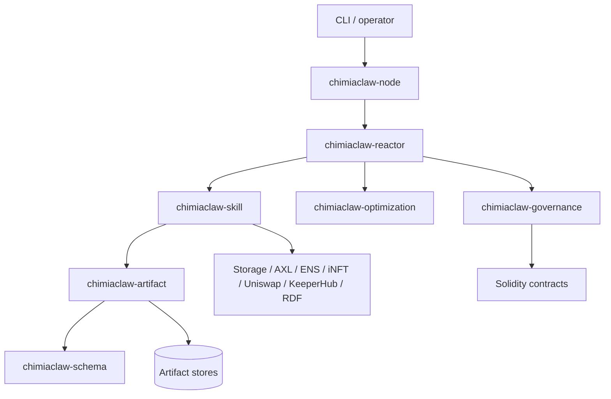
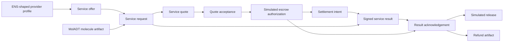
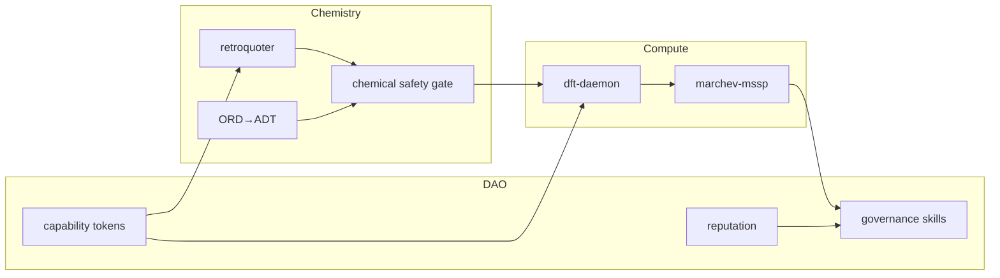
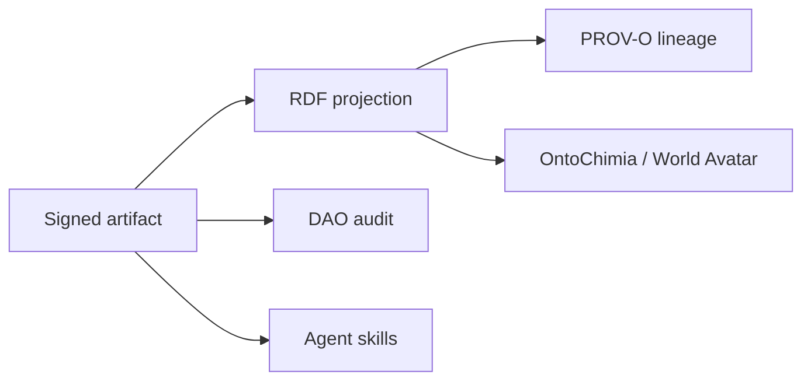
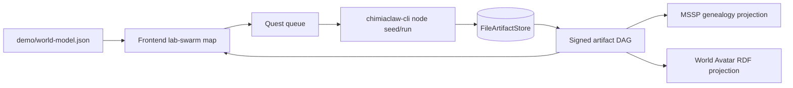

# Architecture

`chimiaclaw` has one canonical state model: the signed artifact DAG.

## Layers

1. **Schema layer**: stable typed identifiers, schema tags, capabilities, and `StrategySet` definitions.
2. **Artifact layer**: immutable signed records with parent lineage.
3. **Market layer**: science service profiles, offers, requests, quotes, quote acceptances, escrow authorizations, settlement intents, result payloads, acknowledgements, releases, and refunds, all represented as artifacts.
4. **Skill layer**: native Rust and foreign-language worker skills that consume and produce artifacts.
5. **Reactor layer**: pressure-scored fulfillment of open needs across agents.
6. **Optimization layer**: MSSP-compatible population, fitness, crossover, tournament, and Type-B switcher abstractions.
7. **Governance layer**: proposals, votes, and executions as artifacts.
8. **Adapter layer**: 0G Storage, AXL, ENS, iNFT, PoX, Uniswap, KeeperHub, and RDF projection.

## Science service market

`chimiaclaw-market` adds the current prize-facing transaction spine:

The deterministic CLI fixture covers retrosynthesis, DFT, and literature. `operator.chimiaclaw.eth` pays the ENS-shaped service agent for a bounded scientific service quote, but the current implementation is non-custodial: it records acceptance, simulated escrow authorization, result acknowledgement, simulated release, and full-refund policy as signed artifacts. Sponsor integrations have explicit attachment points, but the current fixture does not resolve live ENS records, send AXL traffic, write to 0G, call Uniswap, schedule KeeperHub, or move funds.

## MolADT-as-canonical DFT substrate

The DFT branch of the market spine uses `chimiaclaw-moladt` as its source of truth instead of raw SMILES. The `chimiaclaw-moladt` crate mirrors a portable subset of the adjacent Haskell `MolADT-Bayes` molecule representation (atoms, coordinates, formal charges, sigma bonds, Dietz bonding systems, provenance, and projection hints) without vendoring its source. The canonical artifact format is JSON so Rust, Haskell, Python, and remote DFT workers can agree on the same signed payload bytes.

A DFT request now carries:

- a `chem.molecule.adt` molecule artifact with payload-bound canonical bytes;
- a `DftMoleculeRef` inside the service request that names the molecule artifact id and its `payload.hash`;
- a `DftMethodSpec` (functional, basis, backend, dispersion, grid level) that the worker boundary translates into PySCF/GPU4PySCF/ASE invocations;
- the `chem.molecule.adt` artifact as an explicit parent of the `chem.dft.service_request` artifact, so verifiers can re-derive the molecule from the DAG.

`MoleculeAdt::to_xyz` and `MoleculeAdt::to_pyscf_atom_block` are the deterministic projections used to drive the future Skala/PySCF worker; SMILES becomes a derived projection rather than the canonical input. `cargo run -p chimiaclaw-cli -- moladt-dft-demo` is the minimal hand-off surface for that worker boundary.

## Artifact DAG invariants

- Every meaningful state transition is represented by an artifact.
- Parent links encode provenance, genealogy, and governance dependency chains.
- Ordinary research artifacts live in local/decentralized storage with periodic roots on-chain.
- Governance and iNFT-minted artifacts are anchored directly on-chain.
- Consumers validate signatures, content hashes, schema tags, and parent lineage before trusting a result.

## Reference swarms

## ORD→ADT bridge

ORD and ORD-like reaction records are translated into minimal ADT experiments, then sealed as child artifacts. This gives the system a path from public reaction data to agent-executable chemistry.

See `docs/ORD_ADT.md`.

## Marchev / World Avatar integration

The optimization layer is designed to host Marchev's cybernetic stack:

- `opt.cybernetic.*`: eight-subsystem feedback loop.
- `opt.mssp.*`: primitive, crossover, fitness, tournament, terminal check.
- `opt.switcher.*`: strategy simulation, election, commit.

World Avatar interop is a projection: `chimiaclaw-semantic-rdf` maps artifacts to RDF/PROV-O/OntoChimia triples without making RDF the canonical store.

## Frontend world-model projection

The frontend lab-swarm map is a projection over the artifact DAG, not a second source of truth. `demo/world-model.json` gives the UI a deterministic model of ChimiaDAO physical labs, allied labs, virtual agent labs, unknown labs, trust edges, quests, science transactions, agents, artifact cards, MSSP generations, and World Avatar RDF views.

`demo/world-map.html` renders this fixture as a dependency-free static HUD. See `docs/WORLD_MODEL.md` for the fixture shape and current backend mappings.
