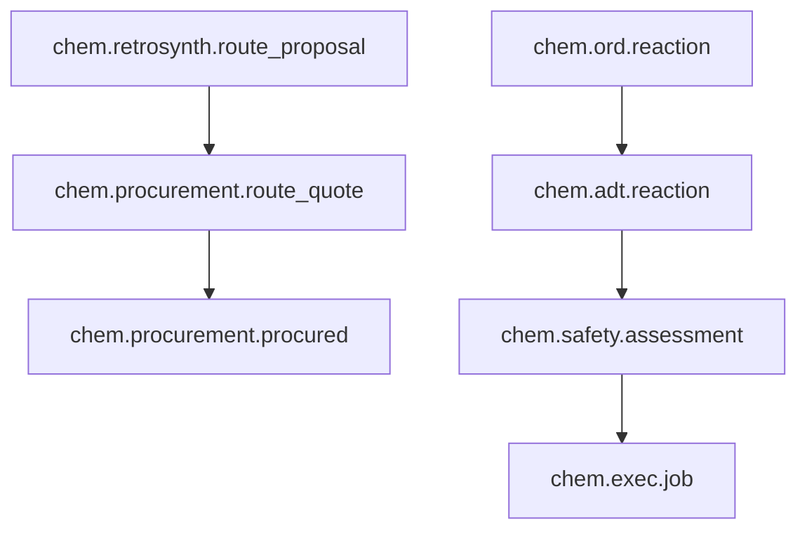
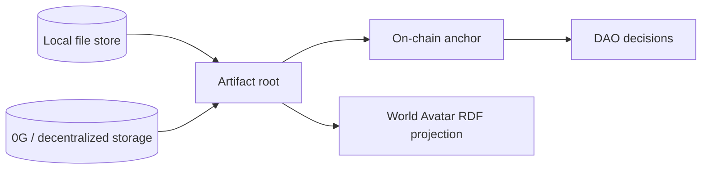

# Artifact DAG

The artifact DAG is the shared state model for ChimiaClaw.

## Artifact fields

An artifact records:

- skill ID
- agent ID
- topic
- input fingerprint
- optional output CID
- parent artifact IDs
- schema tags
- content hash
- signing public key
- signature
- creation timestamp

## Invariants

- Artifacts are immutable once sealed.
- Hashes and IDs are deterministic over canonical content.
- Signatures verify the sealed content.
- Parent IDs encode lineage.
- State transitions create child artifacts rather than mutating parents.

## Example DAGs

## Why this matters

The DAG lets agents work independently while preserving auditability. A downstream agent does not need to trust the upstream agent’s process; it can verify signatures, schema tags, parent lineage, and output hashes.

## Future store layers

Local stores should support fast development. Storage adapters and contracts should anchor selected roots for public verification.
