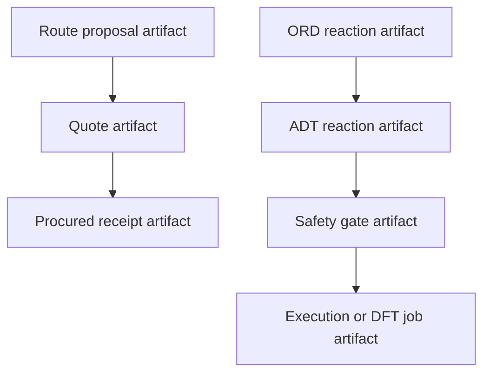

# Decisions

This document records the early architectural choices that should remain stable unless contradicted by implementation evidence.

## D1. Build one substrate, not three products

ChimiaClaw is one Rust-native agent substrate with multiple reference swarms. Retrosynthesis procurement, DFT execution, ORD ingestion, MSSP optimization, and governance share artifacts, skills, reputation, and adapters.

Rejected alternative: three separate hackathon demos. That would demo faster in isolation but would not compound into the DAO runtime.

## D2. Artifact DAG is canonical state

Every meaningful transition should produce a signed artifact:

- route proposal
- quote
- procurement receipt
- ORD import
- ADT translation
- DFT job
- optimization generation
- governance proposal
- vote
- execution intent

State is not mutated in place. A later artifact points to earlier artifacts as parents.

## D3. Keep the Rust core dependency-light

The core crates should remain deterministic and lightweight. Heavy chemistry tooling belongs behind skill/adaptor boundaries unless there is a strong reason to embed it.

Current example: `chimiaclaw-ord-adt` parses ORD-style JSON directly with serde instead of importing Python `ord-schema`, protobuf, RDKit, or Docker-based pipelines.
## D3a. Bind artifacts to canonical payload digests

Artifacts now carry an optional `PayloadRef` whose Blake3 digest is signed alongside the artifact metadata. Inline payloads embed canonical bytes; external payloads carry a CID plus the digest. This means tampering with the scientific or procurement payload invalidates the artifact's `content_hash`. The system signs the payload binding even though the bytes can live off-chain or in decentralized storage.
## D3b. Minimal node runtime is one-shot, not daemonized

`chimiaclaw-node` is a library plus a thin binary. The library exposes `NodeProfile` and `NodeRuntime::run_once`. The runtime opens a file-backed `FileArtifactStore`, scans for parent artifacts whose schema tags match a registered skill's `consumes_tags`, invokes the skill, seals the resulting `ArtifactDraft` with the runtime signer, and persists the child. There is **no** poll loop, no transport, and no capability enforcement yet. A reliable one-shot loop is a more honest foundation than a fake daemon, and the CLI exposes it as `chimiaclaw-cli node run-once --store-dir <path>`.

## D4. Treat ScienceClaw as skill inspiration, not dependency policy

ScienceClaw is useful as a curated skill/requirement inventory. ChimiaClaw should port scientific and chemistry-relevant skills selectively:

- Keep chemistry, DFT, data science, safety, and procurement primitives.
- Avoid unnecessary web/app/deployment skills.
- Avoid Docker-first assumptions where possible.
- Express skills as signed artifact transformations.

## D5. ORD→ADT is a bridge to executable chemistry

ORD is excellent for structured reaction records, but it is not intended as an executable synthesis instruction language. ADTs are the bridge toward on-chain and agent-executable chemistry.

ORD ingestion should preserve:

- roles
- identifiers
- amounts
- conditions
- outcomes
- workups
- provenance
- analyses

ADT translation should produce the minimum executable skeleton first and preserve richer metadata for later safety/procurement/robotics agents.

## D6. On-chain state anchors the DAG, not the full scientific trace

Contracts should anchor proposal/content roots, capability tokens, and reputation-relevant attestations. The detailed scientific trace lives in the artifact DAG and storage adapters.

## D7. Governance is an agent swarm (direction, not present feature)

The long-term direction is that the DAO is not bolted on after the science layer: governance proposals, votes, reviews, capability grants, and execution intents are skill-generated artifacts under the same audit model. Today, the contracts only anchor proposal hashes and emit events; quorum, reputation weighting, and execution authority are not enforced yet.

## D8. Demo reliability beats integration breadth

For the hackathon, one coherent artifact DAG plus one credible scientific bridge is more valuable than many shallow integrations. External adapters can be stubs if their artifact boundaries are clear.
## D9. MolADT is the canonical molecule substrate, not SMILES
`chimiaclaw-moladt` defines the molecule type ChimiaClaw signs and reasons about: atoms with coordinates, formal charges, sigma bonds, Dietz bonding systems, provenance, and projection hints. SMILES is a derived projection on the way out, not the source of truth on the way in. The DFT branch of `chimiaclaw-market` consumes this substrate as an explicit parent of every `chem.dft.service_request` artifact.
MolADTs are produced through three explicit tiers, each tagged in `MoleculeProvenance.source_kind`:
- `schematic-curated` — the curated `chimiaclaw_moladt::library` (water, ammonia, methanol, ethanol, acetic acid, benzene, toluene, bromobenzene, phenylboronic acid, biphenyl) and the ferrocene fixture.
- `geometry-guess-covalent-radii` — the pure-Rust BFS embedder + spring relaxation for connectivity-only molecules.
- `rdkit-etkdgv3-mmff94` (or `...-uff`) — the uv-managed `rdkit-smiles-to-moladt` worker.
Downstream DFT workers must read this field and decide whether to re-optimize before trusting energies; ChimiaClaw will never silently treat a guess as a real geometry.
## D10. Worker boundaries are uv-managed, not Docker-managed
Wherever a Rust skill needs Python (or any non-Rust) tooling, the integration is shaped as a child process invoked through a `CHIMIACLAW_*_COMMAND` environment variable that points at a uv project under `skills/scienceclaw-port/workers/`. No Docker, no Homebrew, no in-process FFI. The worker contract is: read input on stdin or via flags, write a JSON document on stdout, exit non-zero with a stderr message on failure. The Rust adapter validates the payload against a typed schema before sealing it as a signed artifact.
Current workers:
- `cheminformatics/rdkit-smiles-to-moladt` — RDKit ETKDGv3 + MMFF94/UFF → MolADT JSON.
- `retrosynth/askcos-retro` — user-managed ASKCOS endpoint → `chem.retrosynth.template_suggestions`.
The ScienceClaw "scraper fallback" is intentionally not ported because it fabricates demo-like routes that should never enter the signed graph.
## D11. Refuse to invoke external services without explicit operator configuration
Live sponsor adapters and worker boundaries fail closed. ENS resolution, ENS publication, 0G upload, KeeperHub scheduling, ASKCOS retrosynthesis, and the SMILES worker all return a `NotConfigured` error when the relevant environment variable is unset, rather than silently using a default endpoint or fabricating output. This keeps the signed artifact graph free of plausible-looking but unverified data.
## D12. Write-side ENS lives behind a uv worker boundary, not in-process Rust
ENS publication uses the same `CHIMIACLAW_*_COMMAND` worker boundary as MolADT and ASKCOS rather than embedding `web3.py` (or a Rust ENS client) directly into the core crates. The worker (`skills/scienceclaw-port/workers/identity-ens`) reads `ENS_WRITE_PRIVATE_KEY` from the environment and never accepts the key on argv; it refuses chain id 1 unless `--allow-mainnet` is set; it refuses to publish if the configured account is not the registry owner; it skips records whose current value already matches so re-runs are idempotent. The Rust adapter validates the worker output, signs an `identity.ens.publication` artifact, and (via `live ens-publish`) chains the existing read-side resolver and verifier into a three-artifact publication → resolution → verification round-trip.
## D13. Stub mode is a first-class integration tier, not a bug
For sponsor adapters whose real path requires a heavy external binary (currently 0G), the worker exposes an explicit stub mode (`ZEROG_STUB=1`) that hashes the file with Blake2b-32 and emits a deterministic receipt with `STUB MODE` audit notes. The signed artifact still verifies, parents are real, and lineage stays auditable, but the receipt is unmistakably labelled as not-on-chain. This makes CI runs and offline demos honest: ChimiaClaw never silently impersonates a real on-chain anchor, and operators can flip from stub to real by installing `0g-storage-client` and unsetting `ZEROG_STUB` without touching code.
## D14. DFT worker input is a `{request, molecule_adt}` wrapper, not just the request
The `chem.dft.request` artifact is intentionally lightweight: it carries only a `DftMoleculeRef` (artifact id + payload hash) for the molecule, not the atom coordinates themselves. The DFT worker on the other side of `CHIMIACLAW_DFT_COMMAND` needs the actual XYZ to feed into PySCF, so the Rust adapter wraps the request and the parent `chem.molecule.adt` payload into a `DftWorkerInput { request, molecule_adt }` JSON document and pipes that on stdin. The worker therefore never has to make a second round-trip to fetch the molecule, and the artifact graph stays canonical (the `chem.dft.request` artifact is still parented to the `chem.molecule.adt` artifact). The `live dft-execute` CLI also enforces that the supplied molecule artifact id matches the one referenced inside the request, so the wrapper cannot smuggle in a different molecule.
## D15. Functional fallbacks must be explicit in provenance
When the DFT worker is asked for a functional it doesn't have weights for (currently Skala 1.1), it falls back to a stock PySCF functional (PBE) and writes an explicit fallback notice into `provenance.notes`. The `provenance.source_kind` simultaneously flips from `pyscf-skala-1.1` to `pyscf-classical-functional`. This means: (1) the artifact is still real, signed, and auditable; (2) downstream consumers reading `provenance.source_kind` know exactly which path produced the energy; (3) when real Skala 1.1 weights land on duck, switching the operator command from `--backend pyscf-classical` to `--backend pyscf-skala` is the only change needed.
