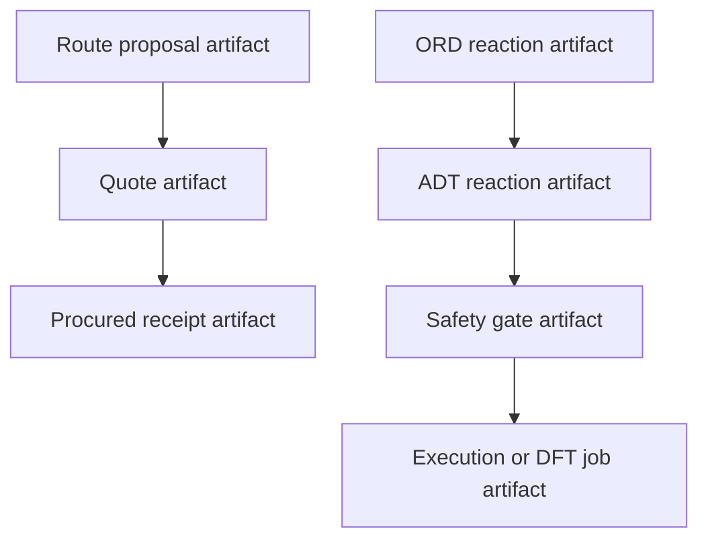

# Decisions

This document records the early architectural choices that should remain stable unless contradicted by implementation evidence.

## D1. Build one substrate, not three products

ChimiaClaw is one Rust-native agent substrate with multiple reference swarms. Retrosynthesis procurement, DFT execution, ORD ingestion, MSSP optimization, and governance share artifacts, skills, reputation, and adapters.

Rejected alternative: three separate hackathon demos. That would demo faster in isolation but would not compound into the DAO runtime.

## D2. Artifact DAG is canonical state

Every meaningful transition should produce a signed artifact:

- route proposal
- quote
- procurement receipt
- ORD import
- ADT translation
- DFT job
- optimization generation
- governance proposal
- vote
- execution intent

State is not mutated in place. A later artifact points to earlier artifacts as parents.

## D3. Keep the Rust core dependency-light

The core crates should remain deterministic and lightweight. Heavy chemistry tooling belongs behind skill/adaptor boundaries unless there is a strong reason to embed it.

Current example: `chimiaclaw-ord-adt` parses ORD-style JSON directly with serde instead of importing Python `ord-schema`, protobuf, RDKit, or Docker-based pipelines.
## D3a. Bind artifacts to canonical payload digests

Artifacts now carry an optional `PayloadRef` whose Blake3 digest is signed alongside the artifact metadata. Inline payloads embed canonical bytes; external payloads carry a CID plus the digest. This means tampering with the scientific or procurement payload invalidates the artifact's `content_hash`. The system signs the payload binding even though the bytes can live off-chain or in decentralized storage.

## D4. Treat ScienceClaw as skill inspiration, not dependency policy

ScienceClaw is useful as a curated skill/requirement inventory. ChimiaClaw should port scientific and chemistry-relevant skills selectively:

- Keep chemistry, DFT, data science, safety, and procurement primitives.
- Avoid unnecessary web/app/deployment skills.
- Avoid Docker-first assumptions where possible.
- Express skills as signed artifact transformations.

## D5. ORD→ADT is a bridge to executable chemistry

ORD is excellent for structured reaction records, but it is not intended as an executable synthesis instruction language. ADTs are the bridge toward on-chain and agent-executable chemistry.

ORD ingestion should preserve:

- roles
- identifiers
- amounts
- conditions
- outcomes
- workups
- provenance
- analyses

ADT translation should produce the minimum executable skeleton first and preserve richer metadata for later safety/procurement/robotics agents.

## D6. On-chain state anchors the DAG, not the full scientific trace

Contracts should anchor proposal/content roots, capability tokens, and reputation-relevant attestations. The detailed scientific trace lives in the artifact DAG and storage adapters.

## D7. Governance is an agent swarm (direction, not present feature)

The long-term direction is that the DAO is not bolted on after the science layer: governance proposals, votes, reviews, capability grants, and execution intents are skill-generated artifacts under the same audit model. Today, the contracts only anchor proposal hashes and emit events; quorum, reputation weighting, and execution authority are not enforced yet.

## D8. Demo reliability beats integration breadth

For the hackathon, one coherent artifact DAG plus one credible scientific bridge is more valuable than many shallow integrations. External adapters can be stubs if their artifact boundaries are clear.
