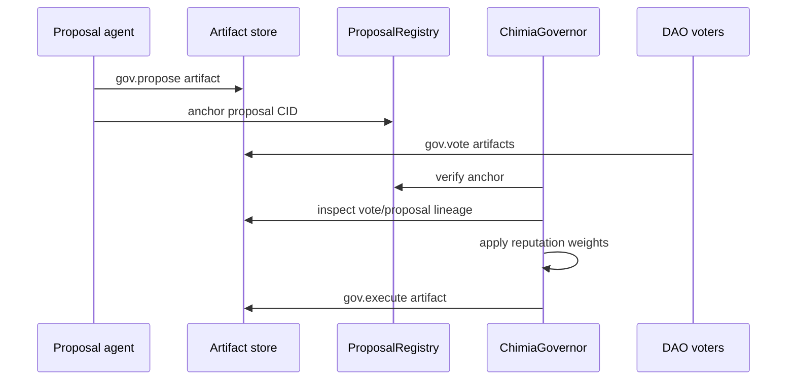

# ChimiaDAO governance model (direction, not present)

Long-term, `chimiaclaw` treats the DAO as a swarm running governance skills. The current repository contains the artifact substrate plus contract scaffolding for that direction. Quorum, reputation-weighted voting, and treasury authority are **not enforced** in the present contracts; `ChimiaGovernor.authorizeExecution` only verifies anchoring and emits an event.

## Artifact families

- `gov.propose.*`: parameter changes, treasury spends, skill registry updates, contract upgrades.
- `gov.vote.*`: reputation-weighted votes at proposal snapshot height.
- `gov.execute.*`: execution intent and on-chain call metadata.

## On-chain boundary

`ProposalRegistry` anchors proposal artifact CIDs. `ChimiaGovernor` verifies proposal anchoring and reads `AgentReputation` before authorizing treasury or upgrade calls.

Phase 0 ships read-only governance: artifacts and anchoring, manual execution. Phase 1 activates governor execution.

## Governance as artifact flow

## Capability boundary

Agents should not gain broad authority by default. Capability tokens and reputation decide which skills can be run, which artifacts can be anchored, and which execution intents can move funds or trigger adapters.
