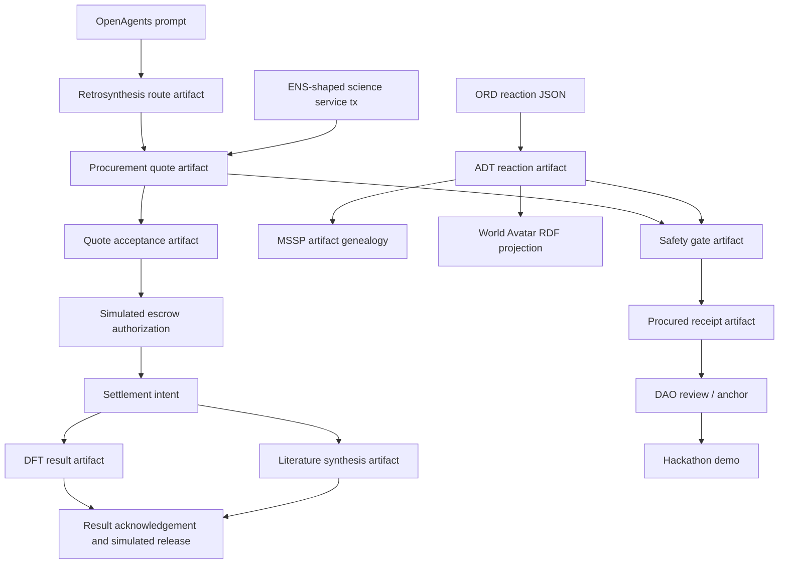

# OpenAgents hackathon scope

## Target prize integrations

- 0G: artifact payload/service catalog storage and compute narrative. Current status: storage adapter scaffold plus 0G URI hints in signed science-market fixtures; no live 0G write yet.
- Gensyn AXL: cross-node agent transport. Current status: transport adapter scaffold plus AXL peer IDs in provider profiles; no separate AXL nodes yet.
- ENS: discoverable agent identities and mutable service/strategy records. Current status: ENS-shaped text-record profiles in signed artifacts; no live resolver call yet.
- Uniswap: science service settlement quotes/intents. Current status: deterministic quote, quote-acceptance, simulated escrow, settlement-intent, result-acknowledgement, release, and refund-policy artifacts with route hints; no live Uniswap API quote or fund movement yet.
- KeeperHub: reliable DFT/literature/settlement execution. Current status: execution hints in service offers/results; no live KeeperHub job scheduling yet.

## Kill switch

If the framework and one reference swarm are not demoable before submission freeze, cut the second swarm. The product is the framework; reference swarms prove it.

## Demo skeleton

1. Start three `chimiaclaw-node` profiles.
2. Register ENS/iNFT identity stubs.
3. Run `retroquoter` route proposal -> quote -> safety -> acceptance/escrow -> settlement intent.
4. Run `dft-daemon` job -> worker result -> mint/settle placeholder.
5. Show artifact DAG and parent lineage across agents.
6. Show `science-market-demo` as the sponsor-aligned transaction spine for DFT, retrosynthesis, and literature services.
7. Show `world-map.html` as the distributed `n*(AI+Scientist)` proof: four real ChimiaDAO nodes plus candidate, virtual, and quarantined endpoints sharing signed data and MSSP / World Avatar concepts.

## Current working proof points

- `cargo run -p chimiaclaw-cli -- demo-dag` produces route proposal → quote → procured receipt, with each child artifact bound to its canonical payload digest via `PayloadRef`.
- `cargo run -p chimiaclaw-cli -- demo-ord-adt` produces ORD-like reaction → ADT reaction child artifact, both payload-bound.
- `cargo run -p chimiaclaw-cli -- science-market-demo` produces deterministic signed ENS-shaped service transactions for retrosynthesis, DFT, and literature. Each flow is profile → offer → request → quote → quote acceptance → simulated escrow authorization → settlement intent → result → result acknowledgement → simulated release, with sponsor attachment points kept honest as fixture/planned-live fields.
- `cargo run -p chimiaclaw-cli -- world-model` prints the deterministic lab-swarm abstraction fixture.
- `cargo run -p chimiaclaw-cli -- world-model verify` verifies the DFT result and Crucible vote artifact references, and now also checks lab interaction invariants: four real nodes, all labs participating, valid source/target lab IDs, and both data/concept channels.
- `demo/world-map.html` renders the abstraction as a dependency-free static HUD: four real ChimiaDAO nodes, all-node lab interactions, data/concept channel counters, trust edges, quests, science transactions, Crucible review votes, artifacts, agents, MSSP genealogy, and World Avatar RDF projection.
- `crates/chimiaclaw-ord-adt` includes an official-ORD-style JSON parser fixture.
- `contracts` has passing scaffold tests for proposal anchoring, capability tokens, and reputation. **Governance execution semantics (quorum, vote weighting, treasury authority) are not yet implemented.**

## Demo narrative diagram

