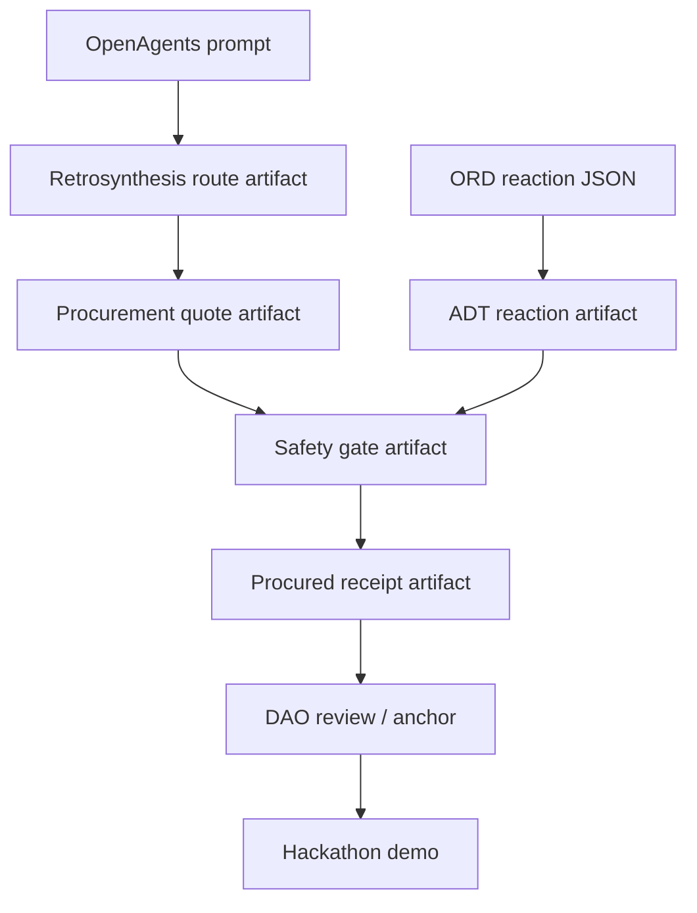

# OpenAgents hackathon scope

## Target prize integrations

- 0G: framework, storage, compute narrative, iNFT-backed agents.
- Gensyn AXL: cross-machine encrypted agent transport.
- ENS: discoverable agent identities and mutable strategy-set text records.
- Uniswap: `retroquoter` settlement intent.
- KeeperHub: `dft-daemon` reliable job execution.

## Kill switch

If the framework and one reference swarm are not demoable before submission freeze, cut the second swarm. The product is the framework; reference swarms prove it.

## Demo skeleton

1. Start three `chimiaclaw-node` profiles.
2. Register ENS/iNFT identity stubs.
3. Run `retroquoter` route proposal -> quote -> safety -> settlement intent.
4. Run `dft-daemon` job -> worker result -> mint/settle placeholder.
5. Show artifact DAG and parent lineage across agents.

## Current working proof points

- `cargo run -p chimiaclaw-cli -- demo-dag` produces route proposal → quote → procured receipt, with each child artifact bound to its canonical payload digest via `PayloadRef`.
- `cargo run -p chimiaclaw-cli -- demo-ord-adt` produces ORD-like reaction → ADT reaction child artifact, both payload-bound.
- `crates/chimiaclaw-ord-adt` includes an official-ORD-style JSON parser fixture.
- `contracts` has passing scaffold tests for proposal anchoring, capability tokens, and reputation. **Governance execution semantics (quorum, vote weighting, treasury authority) are not yet implemented.**

## Demo narrative diagram

