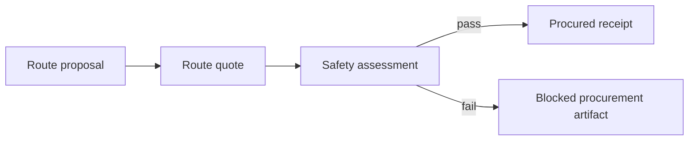

# Next steps

This is the near-term build order after the current scaffold.  
Companion snapshot: [`docs/SUMMARY.md`](./SUMMARY.md).

## 0. Deployable science market (2026-07-12 evening)

### Done

1. ✅ Olympus inventory + Ge→Sn batch (`demo/olympus-dft-inventory.*`, `demo/ge-sn-batch/`).
2. ✅ Sn SCFs on Olympus (majority converged; β-OH explicit fail — do not block product).
3. ✅ ChimeraX MCP (`tools/chimerax_mcp`).
4. ✅ Agents-first `web/` (no draw UI): cashier, catalog, 3D orbitals, payment rails, working API badge.
5. ✅ Gateway: x402 stub, cached DFT SKU, Stripe **Payment Link** wired  
   (`https://buy.stripe.com/5kQ28sahM1zR3mO3gB5Rm00` for both SKUs until split).
6. ✅ Vercel production deploy of `web/`.
7. ✅ Domain plan locked: Porkbun DNS for `chimiadao.io`; `dft` → Vercel; `api` → tunnel.
8. ✅ Docs: `SUMMARY`, `DEPLOY*`, `PAYMENTS`, `DNS_PORKBUN`, `X402`, `MODAL_DFT`.

### Done since resume

9. ✅ `cloudflared` installed (this Mac + Olympus `~/bin/cloudflared`).
10. ✅ Quick tunnel live: `https://biggest-surf-majority-passport.trycloudflare.com` → local `:4021`.
11. ✅ Vercel `NEXT_PUBLIC_API_BASE` set to that tunnel; production redeployed.
12. ✅ Olympus gateway Stripe Payment Link env active (`stripe: configured`).

### Next (ordered)

1. 🟡 **Porkbun:** confirm `A` record `dft` → `76.76.21.21` (Vercel already requested SSL for `dft.chimiadao.io`).
2. 🟡 **Named tunnel (you login once):**  
   `cloudflared tunnel login` → `tunnel create chimiaclaw-api` →  
   Porkbun `CNAME api` → `<id>.cfargotunnel.com` → run on Olympus.
3. 🟡 Point Vercel `NEXT_PUBLIC_API_BASE=https://api.chimiadao.io` once DNS is stable.
4. 🟡 Real Revolut link (replace placeholder); optional second Stripe link per SKU.
5. 🟡 Stripe webhook → fulfillment token (auto-deliver stub MolADT / cached DFT).
6. 🟡 Modal account link + smoke water SCF; keep live DFT operator-gated.
7. 🟡 Seal remaining Sn worker JSON into signed `chem.dft.result` when convenient.
8. 🟡 Live x402 facilitator + real `CHIMIA_X402_PAY_TO` (micro prices only).

### Explicitly not doing

- Draw→structure / image OCR product path  
- Moving Porkbun nameservers to Vercel  
- Claiming live USDC without facilitator  
- Rippling as customer checkout

## 0. Current checkpoint — x402 + website revenue path (2026-07-11)

Parallel track for the agentic economy:

1. ✅ `chimiaclaw-x402` crate: catalog SKUs, challenge/payment/receipt types, signed demo bundle, unit tests.
2. ✅ `ScienceSettlementMethod::X402HttpPayment` + market sponsor binding hint.
3. ✅ CLI: `x402-demo`, `x402-catalog`, `moladt-api` (signed MolADT JSON for the cashier).
4. ✅ `services/api-gateway`: HTTP catalog + 402 gate + paid `POST /v1/moladt` (free/stub/live modes).
5. ✅ `web/` drop-in contract for the Vercel frontend design (awaiting design download). Brand decision: fold into [chimiadao.io](https://www.chimiadao.io) as `/agents` + `api.chimiadao.io`, not a second site.
6. ✅ Cached DFT SKU live: free `GET /v1/dft/index` + paid `GET /v1/dft/cached?label=…` from `DFT_CACHE_DIR` (`demo/dft` signed `chem.dft.result`).
7. ✅ Modal elastic DFT worker scaffold: `skills/scienceclaw-port/workers/dft_modal` (stub/local/modal modes, atom/electron/wall/spend/operator guards, `run_dft_batch` map for H100 swarms). Docs: `docs/MODAL_DFT.md`. Gateway `dft.live_small` remains 501 until Modal account is linked and operator flag is set.
8. 🟡 Link DAO Modal account (`modal setup` + deploy `chimiaclaw-dft`); smoke remote water SCF; set `CHIMIACLAW_DFT_COMMAND` to `chimiaclaw-dft-modal --mode modal`.
9. 🟡 Land chimiadao.io `/agents` (Vercel UI into `web/` or site repo) and wire `NEXT_PUBLIC_API_BASE`.
10. 🟡 Wire official `@x402/express` facilitator verification for `X402_MODE=live`.
11. 🟡 Seal `market.x402.payment` / `receipt` artifacts from the gateway (not only revenue JSONL).
12. 🟡 Set real DAO `CHIMIA_X402_PAY_TO` on Base; graduate stub → live with micro prices.

See `docs/X402.md`.

## 0. Current checkpoint from the 2026-05-12 tri-agent lab-swarm repair

The current working surface is the focused tri-agent lab-swarm dashboard:

1. Literature emits signed `science.literature.synthesis` artifacts.
2. Retrosynthesis consumes curated molecule candidates and emits signed route evidence.
3. DFT consumes `chem.molecule.adt` / `chem.dft.request` parents and emits signed `chem.dft.result` evidence.
4. `demo/world-map.html` prefers `demo/world-model.live.json`, falls back to `demo/world-model.json`, and polls the selected model locally.
5. `demo/live-dashboard-watch.py` now includes live Literature artifacts in its scanned evidence and counts.
6. `demo/world-model.json` projects three applied chemistry lab sites: diester pharmaceutical ingredients, cannabis/cannabinoid analytics, and Ge/Sn APM. Each site repeats the same Literature/Retro/DFT core.
7. `world-model verify` validates both the three-lane core and the new `swarm_sites` / `swarm_site_links` topology.

Validation state:

- `cargo build -p chimiaclaw-cli`
- `cargo test -p chimiaclaw-cli`
- `cargo test -p chimiaclaw-literature`
- `uv run --project skills/literature_synthesis pytest`
- `target/debug/chimiaclaw-cli world-model verify --world-model demo/world-model.json --artifact-dir demo`
- `target/debug/chimiaclaw-cli world-model verify --world-model demo/world-model.live.json --artifact-dir demo`
- `target/debug/chimiaclaw-cli live literature-handoff` converts structural Literature MolADT candidates into signed `chem.molecule.adt` artifacts for supported elements.

Critical gaps to fix next:

- `chimiaclaw-moladt::AtomicSymbol` still lacks Si, Ge, and Sn, so the main-group carbenoid Literature results cannot yet become first-class MolADT/DFT inputs without a deliberate element-support extension.
- `demo/world-model.live.json` is generated live state but remains tracked; the watcher will keep dirtying the worktree until this file is moved, untracked, or treated as an explicit generated fixture.
- The Literature lane is signed and testable, but not yet a chemically validated planner. Extraction-provided coordinates must be geometry-validated before any DFT claim.
- PoX should integrate at the artifact/proof layer: ChimiaClaw artifacts should carry Filecoin CID, `dataHash`, `metricsHash`, experiment type, and reputation-impact metadata in a way that can round-trip through the PoX registry/dashboard.
- `/Users/crischimiadao/Documents/ChimiaDAO-Cannabis/dashboard` is the primary local state for the cannabinoid site. It already contains cultivation analytics, PoX/Filecoin experiment services, experiment classification, and CID/hash validation, but it is not yet round-tripping signed ChimiaClaw artifacts through the PoX registry.

## 0. Current checkpoint from the 2026-05-03 evidence merge

The demo is no longer just a scaffold plus mocked sponsor hooks. The current winning path is:

1. Real AiZynthFinder CASP on Olympus searched five targets and produced solved/unsolved route evidence.
2. Real B3LYP/def2-svp PySCF DFT on Olympus produced three signed precursor result artifacts.
3. A MolADT silicon blocker explicitly records why the TBS alcohol precursor did not proceed to DFT.
4. Live ENS Sepolia publication/resolution/verification proves `chimiaclaw.eth` and five `chimiaclaw.*` text records.
5. Live 0G Galileo Turbo upload anchors a ferrocene MolADT XYZ payload and records the root hash in a signed `storage.zerog.upload` artifact.
6. `demo/world-model.json` and `demo/world-map.html` project all of the above as one lab-swarm / science-market / artifact-DAG story.

Validation state:

- ✅ `python3 -m json.tool demo/world-model.json`
- ✅ `cargo --offline check -p chimiaclaw-cli`
- ✅ `cargo --offline run -p chimiaclaw-cli -- world-model verify --world-model demo/world-model.json --artifact-dir demo` verified 35 signed references with 0 failures.
- ✅ The static dashboard bundle was copied to `duck@olympus.local:/Users/duck/ChimiaDAO/OpenAgents/demo/` and byte-identical hashes matched for world-map/model plus ENS/0G artifacts.

Do not overclaim: ENS and 0G are live sponsor proofs; settlement, wetlab execution, and DAO governance execution are still artifact-ledger simulations or human-gated futures.

## 1. Harden the signed artifact demos

- Keep `demo-dag` stable as the procurement lineage proof, with payload-bound artifacts.
- Keep `demo-ord-adt` stable as the scientific data bridge proof, with payload-bound artifacts.
- Add a compact graph printer for artifact parent/child lineage.
- Add fixture snapshots for demo JSON output once schemas settle.

## 1a. Make the runtime real (in progress)

- ✅ `chimiaclaw-node` now exposes a `NodeProfile` + `NodeRuntime` lib, wired to `FileArtifactStore`.
- ✅ `NodeRuntime::run_once` consumes parent artifacts whose tags match a registered skill's `consumes_tags`, invokes the skill, seals with the runtime signer, and persists payload-bound children.
- ✅ `OrdToAdtSkill` wraps ORD→ADT as the first real `chimiaclaw-skill` implementation.
- ✅ `RouteQuoteSkill` wraps deterministic RetroQuoter route proposal → route quote execution for the same runtime path.
- ✅ CLI `node run` provides a local polling loop with interval, JSONL cycle reports, and `--max-cycles` for scripted demos.
- ✅ Runtime polling is idempotent across changing timestamps: parents with an existing child from a given skill are skipped.
- 🟡 Wire the direct `chimiaclaw-node` daemon binary to profiles instead of routing through `chimiaclaw-cli`.
- 🟡 Add capability checks before skill execution.
- 🟡 Add richer metrics for artifact creation/verification beyond the current JSONL cycle reports.

## 1b. Prepare frontend integration (in progress)

- ✅ Add a deterministic `world-model` CLI surface backed by `demo/world-model.json`.
- ✅ Model the first abstract lab-swarm map: ChimiaDAO physical labs, allied labs, virtual agent labs, unknown labs, trust edges, quests, artifact cards, and swarm agents.
- ✅ Map implemented quests to current CLI flows and schema tags.
- ✅ Add a dependency-free static `demo/world-map.html` renderer for the abstraction.
- ✅ Include MSSP genealogy and World Avatar RDF projection as explicit model layers.
- ✅ Add a science service market layer for ENS-shaped DFT, retrosynthesis, and literature transaction flows.
- ✅ Add a real `LAB.CHIMIA.04` Olympus DFT Worker node + Olympus↔Analysis-Dock and Virtual-Retro-Swarm→Olympus trust edges to the world-model. Six new `science_transactions` tagged `real-execution` reference the real signed `chem.dft.result` artifact IDs (water, methanol, benzene, propylene glycol, caprylic acid, capric acid).
- ✅ Make `world-map.html` interactive: per-lab incoming-transaction count badges, click-to-filter transactions by target lab, animated dashed flow lines for operator→lab plus inbound dispatch and outbound result-return paths, highlighted trust edges that involve the selected lab, transactions grouped by `service_kind` with per-group real-exec counts and a green REAL EXECUTION pill.
- ✅ Build a Next.js dashboard (`SciCrucible_v1/`) that loads the six signed `chem.dft.result` artifacts directly from `public/artifacts/`: typed loader at `lib/dft-artifacts.ts` (hex-decodes inline payloads, pairs each result with its three orbital-cube PNGs), `/dft` gallery, `/dft/[id]` detail page with cubes / orbitals / dipole / geometry / signed lineage panels.
- ✅ Add a `chimiaclaw-crucible` workspace crate exposing `crucible.review.vote` so the dashboard's voting flow has a real signed-artifact target (closed VoteKind enum, layered ORCID/ENS/eth identity, content-hash binding, parent = target artifact, 8 unit tests).
- 🟡 Wire dashboard vote actions through `chimiaclaw-crucible::vote_artifact` so each upvote / peer-review action becomes a real signed `crucible.review.vote` artifact.
- 🟡 Replace symbolic lab nodes with operator-approved profile/config data when custody rules are ready.

## 1c. Make science transactions prize-track credible (in progress)

- ✅ Add `chimiaclaw-market` with deterministic service profiles, offers, requests, quotes, settlement intents, and results.
- ✅ Add `science-market-demo` CLI output for three signed payload-bound flows: retrosynthesis, DFT, and literature.
- ✅ Add artifact-native settlement lifecycle records: quote acceptance, simulated escrow authorization, result acknowledgement, simulated release, and refund policy.
- ✅ Project the transaction flows and settlement lifecycle into `demo/world-model.json` and `demo/world-map.html`.
- ✅ Replace raw SMILES DFT inputs with a canonical `chimiaclaw-moladt` molecule artifact bound to each DFT service request, including `Skala 1.1` / `def2-tzvp` method spec and a `moladt-dft-demo` CLI surface for downstream workers.
- ✅ First open ORD→MolADT bridge: curated SMILES→MoleculeAdt library, `chimiaclaw-ord-adt::translate_reaction`, and `ord-moladt-demo` CLI subcommand that signs one `chem.molecule.adt` per resolved substrate and explicitly reports `NotInLibrary` / `UnsafeForDirectDft` skips so multi-component salts and transition-metal complexes never silently reach the DFT worker.
- ✅ Pure-Rust geometry guesser (`chimiaclaw_moladt::geometry`, Cordero 2008 covalent radii + spring relaxation), pure-Rust SVG renderer (`chimiaclaw_moladt::render`), `MoleculeAdt::write_xyz_to`, and a `moladt-render` CLI plus `ord-moladt-demo --output-dir` that writes one `.xyz` and one `.svg` per resolved substrate.
- ✅ uv-managed `rdkit-smiles-to-moladt` worker under `skills/scienceclaw-port/workers/cheminformatics` (RDKit ETKDGv3 + MMFF94/UFF) wired through `CHIMIACLAW_SMILES_TO_MOLADT_COMMAND` and consumed by `chimiaclaw_moladt::worker::resolve_with_worker`.
- ✅ uv-managed `askcos-retro` worker under `skills/scienceclaw-port/workers/retrosynth` plus `chimiaclaw-retrosynth-askcos` Rust adapter that signs the response as a `chem.retrosynth.template_suggestions` artifact; refuses to run without `CHIMIACLAW_ASKCOS_ENDPOINT` + `CHIMIACLAW_ASKCOS_COMMAND` and rejects empty proposals so no fabricated routes can enter the signed graph.
- ✅ First end-to-end SMILES→MolADT round-trip through the uv RDKit worker (`O=Cc1ccccc1` → 14 atoms, source_kind `rdkit-etkdgv3-mmff94`) with seven verified non-curated targets (benzaldehyde, aspirin, salicylic acid, pyridine, methylamine, imidazole, acetone) materialized at `demo/molecules/`.
- ✅ Real PBE/def2-tzvp DFT calculations on `duck@olympus.local` through `CHIMIACLAW_DFT_COMMAND` and the `chimiaclaw-dft` uv worker.
- ✅ Six-molecule signed DFT gallery (water, methanol, benzene, propylene glycol, caprylic acid C8, capric acid C10) saved at `demo/dft/`.
- ✅ Orbital density cubes (HOMO, LUMO, total electron density) generated via `pyscf.tools.cubegen`, content-addressed via SHA-256 in the signed `chem.dft.result.orbital_densities[]` block; 18 cubes under `demo/dft/cubes/`.
- ✅ Arbitrary SMILES via `moladt-dft-demo --smiles` resolved through the RDKit ETKDGv3 + MMFF94 worker (`CHIMIACLAW_SMILES_TO_MOLADT_COMMAND`) on duck.
- 🟡 Wire real Skala 1.1 weights on duck so `--backend pyscf-skala` stops falling back to PBE.
- 🟡 Run a transition-metal organometallic through `live dft-execute` (UKS for open-shell d-block).
- 🟡 Optional: anchor a representative cube file on 0G Galileo (the existing `live zerog-anchor` already accepts arbitrary payload files).
- ✅ Content-hashed disk cache for `askcos-retro` (`~/.cache/chimiaclaw/askcos` by default, override via `--cache-dir` or `CHIMIACLAW_ASKCOS_CACHE_DIR`); first call populates the cache, identical follow-up calls return zero-network cache hits; `--cache-only` mode supports offline replay; the signed artifact now carries an `AskcosCacheRecord { hit, key, path }`.
- 🟡 Wire `chimiaclaw-retrosynth-askcos` into `apps/retroquoter` so the existing deterministic route quote becomes a child of a real ASKCOS template-suggestions artifact (the cache is now in place to keep that wiring fast and offline-replayable).
- 🟡 Extend `askcos-retro` from `template-relevance` to ASKCOS tree-expansion plus an in-stock filter (eMolecules / ChemSpace / Sigma-Aldrich) so multi-step routes only reference commercially-available reagents.
- 🟡 Add a `chimiaclaw_moladt::library` SDF/MolBlock importer so the curated library can grow from external sources without inflating the Rust source.
- ✅ Live ENS read-side: `chimiaclaw-identity-ens` resolver + verifier behind `live ens-verify` produces signed `identity.ens.resolution` + `identity.ens.verification` artifacts (gated behind `live-sponsors`).
- ✅ Live ENS write-side: uv worker `identity-ens` (web3.py + `ens.set_text`, idempotent, refuses mainnet + non-owner accounts, never accepts the key on argv) + `EnsPublisherCommandConfig` Rust adapter + `live ens-publish` CLI that chains publication → resolution → verification into three signed artifacts; operator runbook at `demo/ens-roundtrip.sh`.
- ✅ 0G stub mode: uv worker `storage-0g` shells out to `${ZEROG_BINARY:-0g-storage-client}` for real uploads, or with `ZEROG_STUB=1` hashes the file with Blake2b-32 to produce a deterministic, explicitly-labelled stub receipt; end-to-end stub run produced signed `storage.zerog.upload` artifact `art_62a1177fa495209f` parented to a real ferrocene MolADT (saved at `demo/zerog/anchor-stub.json`); operator runbook at `demo/zerog-roundtrip.sh`.
- ✅ KeeperHub workflow runbook: reference manual-trigger workflow at `demo/keeperhub/workflow.json` plus operator README chaining DFT request → KeeperHub schedule → 0G anchor through the existing `chimiaclaw-exec-keeperhub` Rust REST client (no new Python worker required).
- ✅ Replace ENS-shaped fixtures with a live ENS Sepolia round-trip for `chimiaclaw.eth`: publication artifact `art_bcf73364c39fb152`, resolution artifact `art_bc5f74fa853df294`, verification artifact `art_1eb873d15595ba6e`, chain id `11155111`, and five `chimiaclaw.*` text records.
- ✅ Store a representative scientific payload through live 0G Galileo Turbo: `storage.zerog.upload` artifact `art_06b4ba819c6222bc` anchors ferrocene MolADT source artifact `art_c6fb4314b4dc7ac7` to root `0x064c41c425f74b52218f8d9eaf8cc04388d93721262746185f52c23eac13e7c7`.
- 🟡 Send at least one service request/result across two real AXL nodes.
- 🟡 Store a large request/result payload, a cube bundle, and a service catalog root through 0G Storage.
- 🟡 Replace settlement route hints with a real Uniswap API quote and live payment adapter, still requiring explicit operator confirmation before any transaction or fund movement.
- 🟡 Schedule one DFT or literature job through KeeperHub CLI/MCP.

## 2. Add a chemical safety gate

Insert a signed safety artifact between quote and procurement:

The first version can be deterministic and rule-based:

- flag known hazardous reagents
- require missing SDS metadata to be explicit
- preserve uncertainty as signed output
- never silently mark unknown chemistry safe

## 3. Improve ORD ingestion

- Add a small CLI mode that reads official ORD Reaction JSON from a file.
- Add a Python helper for `.pb.gz` Dataset → Reaction JSON conversion using `uv`.
- Add more official-ORD-ish fixtures:
  - missing product
  - solvent mixtures
  - multiple outcomes
  - no explicit reaction time
  - product purity and yield
- Preserve invalid or incomplete fields as warnings/artifacts rather than panics.

## 4. Expand ADT expressiveness

- Add explicit roles to reaction inputs, not only samples.
- Add workup/product sections if the ADT schema evolves.
- Add Chemputer/XDL export from ADT.
- Add a minimal ADT schema test fixture in the Rust crate.

## 5. Curate the first real skill set

Port only the useful ScienceClaw-derived skills first:

- `rdkit` or non-Python molecule canonicalization adapter
- `datamol`
- `pubchem`
- `chembl`
- `cas`
- `chemical-safety`
- `askcos` endpoint adapter
- `ase`
- `dft`
- `pymatgen`
- `openmm`

## 6. Make node execution credible

- Define local node profile config.
- Add a file-backed artifact store. ✅
- Add a simple skill runner. ✅
- Add a local polling command with deterministic ORD→ADT and route quote skills. ✅
- Add capability checks before skill execution.
- Add structured logs for artifact creation and verification.

## 7. Strengthen governance bridge

- Anchor artifact CIDs through contracts.
- Link proposal artifacts to execution artifacts.
- Add reputation-weighted vote fixtures.
- Keep manual execution until the artifact flow is stable.

## 8. Prepare the hackathon demo narrative

Target story:

1. ChimiaClaw imports or creates chemistry.
2. Agents transform it into signed artifacts.
3. External CASP and real DFT workers add live scientific evidence without breaking the artifact DAG.
4. ENS Sepolia proves the service identity and capability pointers.
5. 0G Galileo proves at least one public scientific payload has a live storage anchor.
6. ENS-shaped service agents quote DFT, retrosynthesis, identity, storage, and literature work as signed transactions with visible acceptance, escrow, acknowledgement, release, and refund boundaries.
7. Procurement/safety/DFT swarms consume the artifacts.
8. The DAO can inspect provenance and authorize next actions.

Keep the demo deterministic. A reliable artifact DAG beats a flaky live model call.
