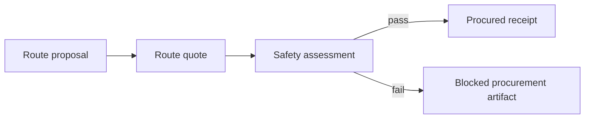

# Next steps

This is the near-term build order after the current scaffold.

## 1. Harden the signed artifact demos

- Keep `demo-dag` stable as the procurement lineage proof, with payload-bound artifacts.
- Keep `demo-ord-adt` stable as the scientific data bridge proof, with payload-bound artifacts.
- Add a compact graph printer for artifact parent/child lineage.
- Add fixture snapshots for demo JSON output once schemas settle.

## 1a. Make the runtime real (in progress)

- ✅ `chimiaclaw-node` now exposes a `NodeProfile` + `NodeRuntime` lib, wired to `FileArtifactStore`.
- ✅ `NodeRuntime::run_once` consumes parent artifacts whose tags match a registered skill's `consumes_tags`, invokes the skill, seals with the runtime signer, and persists payload-bound children.
- ✅ `OrdToAdtSkill` wraps ORD→ADT as the first real `chimiaclaw-skill` implementation.
- ✅ `RouteQuoteSkill` wraps deterministic RetroQuoter route proposal → route quote execution for the same runtime path.
- ✅ CLI `node run` provides a local polling loop with interval, JSONL cycle reports, and `--max-cycles` for scripted demos.
- ✅ Runtime polling is idempotent across changing timestamps: parents with an existing child from a given skill are skipped.
- 🟡 Wire the direct `chimiaclaw-node` daemon binary to profiles instead of routing through `chimiaclaw-cli`.
- 🟡 Add capability checks before skill execution.
- 🟡 Add richer metrics for artifact creation/verification beyond the current JSONL cycle reports.

## 1b. Prepare frontend integration (in progress)

- ✅ Add a deterministic `world-model` CLI surface backed by `demo/world-model.json`.
- ✅ Model the first abstract lab-swarm map: ChimiaDAO physical labs, allied labs, virtual agent labs, unknown labs, trust edges, quests, artifact cards, and swarm agents.
- ✅ Map implemented quests to current CLI flows and schema tags.
- ✅ Add a dependency-free static `demo/world-map.html` renderer for the abstraction.
- ✅ Include MSSP genealogy and World Avatar RDF projection as explicit model layers.
- ✅ Add a science service market layer for ENS-shaped DFT, retrosynthesis, and literature transaction flows.
- 🟡 Build the actual frontend renderer against the static fixture before introducing live APIs.
- 🟡 Replace symbolic lab nodes with operator-approved profile/config data when custody rules are ready.

## 1c. Make science transactions prize-track credible (in progress)

- ✅ Add `chimiaclaw-market` with deterministic service profiles, offers, requests, quotes, settlement intents, and results.
- ✅ Add `science-market-demo` CLI output for three signed payload-bound flows: retrosynthesis, DFT, and literature.
- ✅ Add artifact-native settlement lifecycle records: quote acceptance, simulated escrow authorization, result acknowledgement, simulated release, and refund policy.
- ✅ Project the transaction flows and settlement lifecycle into `demo/world-model.json` and `demo/world-map.html`.
- ✅ Replace raw SMILES DFT inputs with a canonical `chimiaclaw-moladt` molecule artifact bound to each DFT service request, including `Skala 1.1` / `def2-tzvp` method spec and a `moladt-dft-demo` CLI surface for downstream workers.
- ✅ First open ORD→MolADT bridge: curated SMILES→MoleculeAdt library, `chimiaclaw-ord-adt::translate_reaction`, and `ord-moladt-demo` CLI subcommand that signs one `chem.molecule.adt` per resolved substrate and explicitly reports `NotInLibrary` / `UnsafeForDirectDft` skips so multi-component salts and transition-metal complexes never silently reach the DFT worker.
- ✅ Pure-Rust geometry guesser (`chimiaclaw_moladt::geometry`, Cordero 2008 covalent radii + spring relaxation), pure-Rust SVG renderer (`chimiaclaw_moladt::render`), `MoleculeAdt::write_xyz_to`, and a `moladt-render` CLI plus `ord-moladt-demo --output-dir` that writes one `.xyz` and one `.svg` per resolved substrate.
- ✅ uv-managed `rdkit-smiles-to-moladt` worker under `skills/scienceclaw-port/workers/cheminformatics` (RDKit ETKDGv3 + MMFF94/UFF) wired through `CHIMIACLAW_SMILES_TO_MOLADT_COMMAND` and consumed by `chimiaclaw_moladt::worker::resolve_with_worker`.
- ✅ uv-managed `askcos-retro` worker under `skills/scienceclaw-port/workers/retrosynth` plus `chimiaclaw-retrosynth-askcos` Rust adapter that signs the response as a `chem.retrosynth.template_suggestions` artifact; refuses to run without `CHIMIACLAW_ASKCOS_ENDPOINT` + `CHIMIACLAW_ASKCOS_COMMAND` and rejects empty proposals so no fabricated routes can enter the signed graph.
- ✅ First end-to-end SMILES→MolADT round-trip through the uv RDKit worker (`O=Cc1ccccc1` → 14 atoms, source_kind `rdkit-etkdgv3-mmff94`) with seven verified non-curated targets (benzaldehyde, aspirin, salicylic acid, pyridine, methylamine, imidazole, acetone) materialized at `demo/molecules/`.
- 🟡 Run real Skala/PySCF/GPU4PySCF DFT calculations against the resolved MolADT artifacts on `duck@olympus.local` through a `CHIMIACLAW_DFT_COMMAND` wrapper, persisting energies/orbitals as `chem.dft.result` artifacts.
- ✅ Content-hashed disk cache for `askcos-retro` (`~/.cache/chimiaclaw/askcos` by default, override via `--cache-dir` or `CHIMIACLAW_ASKCOS_CACHE_DIR`); first call populates the cache, identical follow-up calls return zero-network cache hits; `--cache-only` mode supports offline replay; the signed artifact now carries an `AskcosCacheRecord { hit, key, path }`.
- 🟡 Wire `chimiaclaw-retrosynth-askcos` into `apps/retroquoter` so the existing deterministic route quote becomes a child of a real ASKCOS template-suggestions artifact (the cache is now in place to keep that wiring fast and offline-replayable).
- 🟡 Extend `askcos-retro` from `template-relevance` to ASKCOS tree-expansion plus an in-stock filter (eMolecules / ChemSpace / Sigma-Aldrich) so multi-step routes only reference commercially-available reagents.
- 🟡 Add a `chimiaclaw_moladt::library` SDF/MolBlock importer so the curated library can grow from external sources without inflating the Rust source.
- ✅ Live ENS read-side: `chimiaclaw-identity-ens` resolver + verifier behind `live ens-verify` produces signed `identity.ens.resolution` + `identity.ens.verification` artifacts (gated behind `live-sponsors`).
- ✅ Live ENS write-side: uv worker `identity-ens` (web3.py + `ens.set_text`, idempotent, refuses mainnet + non-owner accounts, never accepts the key on argv) + `EnsPublisherCommandConfig` Rust adapter + `live ens-publish` CLI that chains publication → resolution → verification into three signed artifacts; operator runbook at `demo/ens-roundtrip.sh`.
- ✅ 0G stub mode: uv worker `storage-0g` shells out to `${ZEROG_BINARY:-0g-storage-client}` for real uploads, or with `ZEROG_STUB=1` hashes the file with Blake2b-32 to produce a deterministic, explicitly-labelled stub receipt; end-to-end stub run produced signed `storage.zerog.upload` artifact `art_62a1177fa495209f` parented to a real ferrocene MolADT (saved at `demo/zerog/anchor-stub.json`); operator runbook at `demo/zerog-roundtrip.sh`.
- ✅ KeeperHub workflow runbook: reference manual-trigger workflow at `demo/keeperhub/workflow.json` plus operator README chaining DFT request → KeeperHub schedule → 0G anchor through the existing `chimiaclaw-exec-keeperhub` Rust REST client (no new Python worker required).
- 🟡 Replace ENS-shaped fixtures with live ENS text-record resolution end-to-end on a real testnet name (publisher + resolver are in place; awaits an operator-supplied testnet ENS name and funded controller key).
- 🟡 Send at least one service request/result across two real AXL nodes.
- 🟡 Store a large request/result payload and service catalog root through 0G Storage.
- 🟡 Replace settlement route hints with a real Uniswap API quote and live payment adapter, still requiring explicit operator confirmation before any transaction or fund movement.
- 🟡 Schedule one DFT or literature job through KeeperHub CLI/MCP.

## 2. Add a chemical safety gate

Insert a signed safety artifact between quote and procurement:

The first version can be deterministic and rule-based:

- flag known hazardous reagents
- require missing SDS metadata to be explicit
- preserve uncertainty as signed output
- never silently mark unknown chemistry safe

## 3. Improve ORD ingestion

- Add a small CLI mode that reads official ORD Reaction JSON from a file.
- Add a Python helper for `.pb.gz` Dataset → Reaction JSON conversion using `uv`.
- Add more official-ORD-ish fixtures:
  - missing product
  - solvent mixtures
  - multiple outcomes
  - no explicit reaction time
  - product purity and yield
- Preserve invalid or incomplete fields as warnings/artifacts rather than panics.

## 4. Expand ADT expressiveness

- Add explicit roles to reaction inputs, not only samples.
- Add workup/product sections if the ADT schema evolves.
- Add Chemputer/XDL export from ADT.
- Add a minimal ADT schema test fixture in the Rust crate.

## 5. Curate the first real skill set

Port only the useful ScienceClaw-derived skills first:

- `rdkit` or non-Python molecule canonicalization adapter
- `datamol`
- `pubchem`
- `chembl`
- `cas`
- `chemical-safety`
- `askcos` endpoint adapter
- `ase`
- `dft`
- `pymatgen`
- `openmm`

## 6. Make node execution credible

- Define local node profile config.
- Add a file-backed artifact store. ✅
- Add a simple skill runner. ✅
- Add a local polling command with deterministic ORD→ADT and route quote skills. ✅
- Add capability checks before skill execution.
- Add structured logs for artifact creation and verification.

## 7. Strengthen governance bridge

- Anchor artifact CIDs through contracts.
- Link proposal artifacts to execution artifacts.
- Add reputation-weighted vote fixtures.
- Keep manual execution until the artifact flow is stable.

## 8. Prepare the hackathon demo narrative

Target story:

1. ChimiaClaw imports or creates chemistry.
2. Agents transform it into signed artifacts.
3. ENS-shaped service agents quote DFT, retrosynthesis, and literature work as signed transactions with visible acceptance, escrow, acknowledgement, release, and refund boundaries.
4. Procurement/safety/DFT swarms consume the artifacts.
5. The DAO can inspect provenance and authorize next actions.

Keep the demo deterministic. A reliable artifact DAG beats a flaky live model call.
