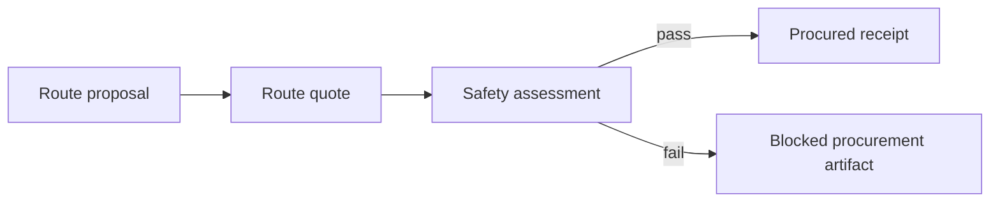

# Next steps

This is the near-term build order after the current scaffold.

## 1. Harden the signed artifact demos

- Keep `demo-dag` stable as the procurement lineage proof, with payload-bound artifacts.
- Keep `demo-ord-adt` stable as the scientific data bridge proof, with payload-bound artifacts.
- Add a compact graph printer for artifact parent/child lineage.
- Add fixture snapshots for demo JSON output once schemas settle.

## 1a. Make the runtime real

- Wire `chimiaclaw-node` to a file-backed artifact store.
- Run a one-shot loop that consumes a parent artifact and produces a payload-bound child via a registered skill.
- Wrap ORD→ADT as the first real `Skill` implementation behind `chimiaclaw-skill`.

## 2. Add a chemical safety gate

Insert a signed safety artifact between quote and procurement:

The first version can be deterministic and rule-based:

- flag known hazardous reagents
- require missing SDS metadata to be explicit
- preserve uncertainty as signed output
- never silently mark unknown chemistry safe

## 3. Improve ORD ingestion

- Add a small CLI mode that reads official ORD Reaction JSON from a file.
- Add a Python helper for `.pb.gz` Dataset → Reaction JSON conversion using `uv`.
- Add more official-ORD-ish fixtures:
  - missing product
  - solvent mixtures
  - multiple outcomes
  - no explicit reaction time
  - product purity and yield
- Preserve invalid or incomplete fields as warnings/artifacts rather than panics.

## 4. Expand ADT expressiveness

- Add explicit roles to reaction inputs, not only samples.
- Add workup/product sections if the ADT schema evolves.
- Add Chemputer/XDL export from ADT.
- Add a minimal ADT schema test fixture in the Rust crate.

## 5. Curate the first real skill set

Port only the useful ScienceClaw-derived skills first:

- `rdkit` or non-Python molecule canonicalization adapter
- `datamol`
- `pubchem`
- `chembl`
- `cas`
- `chemical-safety`
- `askcos` endpoint adapter
- `ase`
- `dft`
- `pymatgen`
- `openmm`

## 6. Make node execution credible

- Define local node profile config.
- Add a file-backed artifact store.
- Add a simple skill runner.
- Add capability checks before skill execution.
- Add structured logs for artifact creation and verification.

## 7. Strengthen governance bridge

- Anchor artifact CIDs through contracts.
- Link proposal artifacts to execution artifacts.
- Add reputation-weighted vote fixtures.
- Keep manual execution until the artifact flow is stable.

## 8. Prepare the hackathon demo narrative

Target story:

1. ChimiaClaw imports or creates chemistry.
2. Agents transform it into signed artifacts.
3. Procurement/safety/DFT swarms consume the artifacts.
4. The DAO can inspect provenance and authorize next actions.

Keep the demo deterministic. A reliable artifact DAG beats a flaky live model call.
