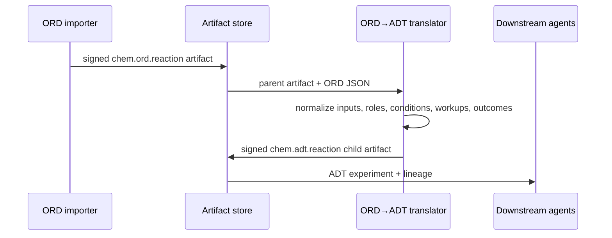
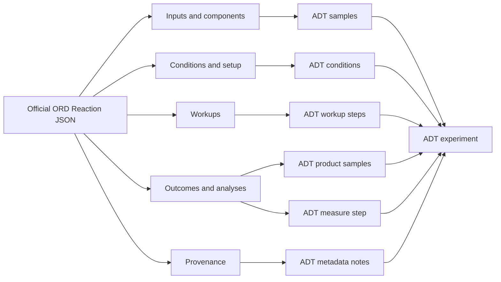

# ORD to ADT bridge

`crates/chimiaclaw-ord-adt` translates reaction records into the minimal ADT reaction schema from the earlier ChimiaDAO OxAI ADT hack.

The bridge is intentionally Rust-native, deterministic, and dependency-light. It accepts two input families:

- OxAI/ChimiaDAO ORD-like JSON used in the earlier hackathon stack.
- A lightweight subset of official Open Reaction Database Reaction JSON exported with protobuf field names preserved.

## Tags and skill identity

- ORD reaction artifact tag: `chem.ord.reaction`
- ADT reaction artifact tag: `chem.adt.reaction`
- Translator skill: `chem.ord.to_adt.v1`
- Translator agent: `ord-adt.chimiaclaw.eth`

## Flow



## Official ORD JSON fields currently used

The adapter handles a practical subset of the official ORD `Reaction` shape:

- `reaction_id`
- `identifiers` with `REACTION_SMILES` or `REACTION_CXSMILES`
- `inputs` as a map of labeled `ReactionInput` values
- `components`
- compound `identifiers`, especially `NAME`, `IUPAC_NAME`, `CAS_NUMBER`, `SMILES`, `CXSMILES`, `INCHI`, `MOLBLOCK`
- compound `reaction_role`
- moles amounts with `MOLE`, `MILLIMOLE`, `MICROMOLE`, and `NANOMOLE`
- compound/input `texture` mapped to ADT phase
- `setup.vessel.preparations`
- `setup.environment`
- `conditions.temperature.setpoint`
- `conditions.stirring.rate.rpm`
- `conditions.pressure.atmosphere`
- `notes.is_sensitive_to_oxygen`
- `workups`
- `outcomes.reaction_time`
- `outcomes.products`
- product measurements for `YIELD` and `PURITY`
- `outcomes.analyses`
- provenance fields such as DOI, publication URL, city, record creation time, and experimenter metadata

## Normalized ADT output

The output `AdtExperiment` contains:

- metadata title/version/authors/notes
- samples with IDs, labels, SMILES-like identifiers, amount in mmol, phase, optional role, optional purity, and optional yield
- reaction inputs pointing to sample IDs
- conditions with temperature, time, inert flag, and stirring RPM
- steps such as `Charge`, `Heat`, `StirTo`, `Wait`, `Add`, `Quench`, `Measure`, and `Purify`



## Current limitations

- The adapter parses JSON, not `.pb.gz` protobuf directly.
- It does not validate SMILES or roles chemically.
- It does not yet infer stoichiometry from reaction SMILES.
- It preserves a single analysis method in the procedural skeleton.
- It does not yet emit a richer Chemputer/XDL instruction sequence.
- It does not yet connect to procurement/safety gates automatically.

## Public ingestion pattern

Official ORD data is stored as compressed protobuf datasets. A future ingestion script can convert `.pb.gz` files into JSON before feeding the Rust bridge:

```python
from ord_schema.message_helpers import load_message
from ord_schema.proto import dataset_pb2
from google.protobuf.json_format import MessageToJson

dataset = load_message("input.pb.gz", dataset_pb2.Dataset)
reaction = dataset.reactions[0]
json_text = MessageToJson(
    reaction,
    preserving_proto_field_name=True,
    use_integers_for_enums=False,
)
```

Use `uv` or `uvx` for any Python helper environment rather than adding Python dependencies to the Rust core.
