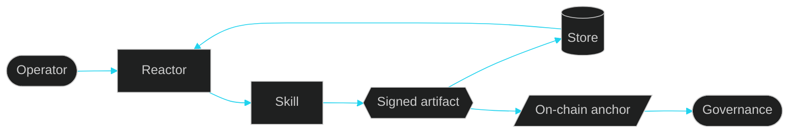
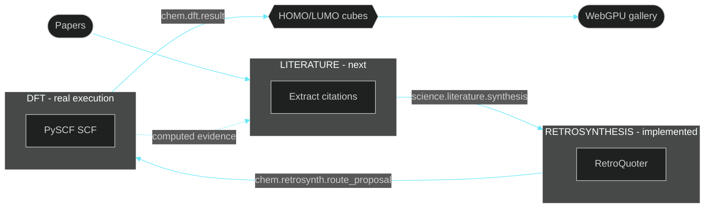
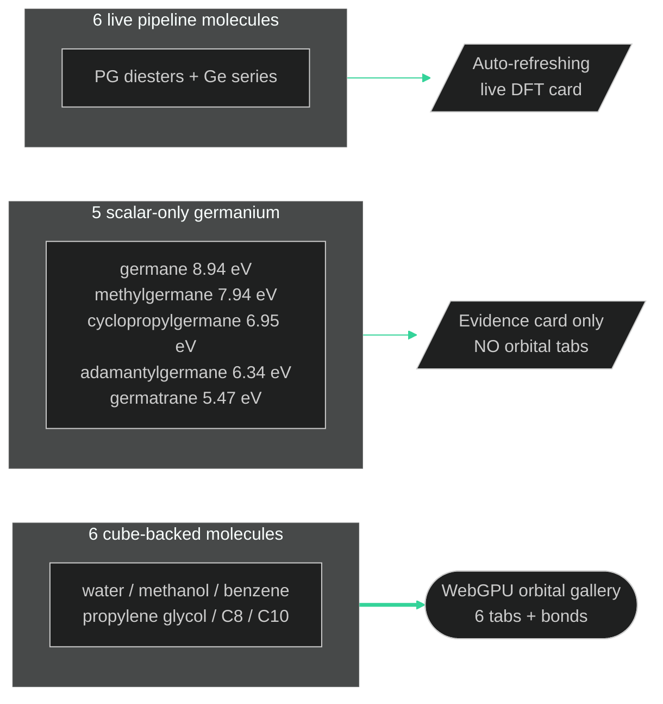
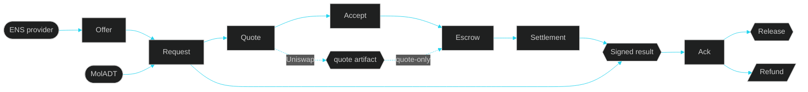
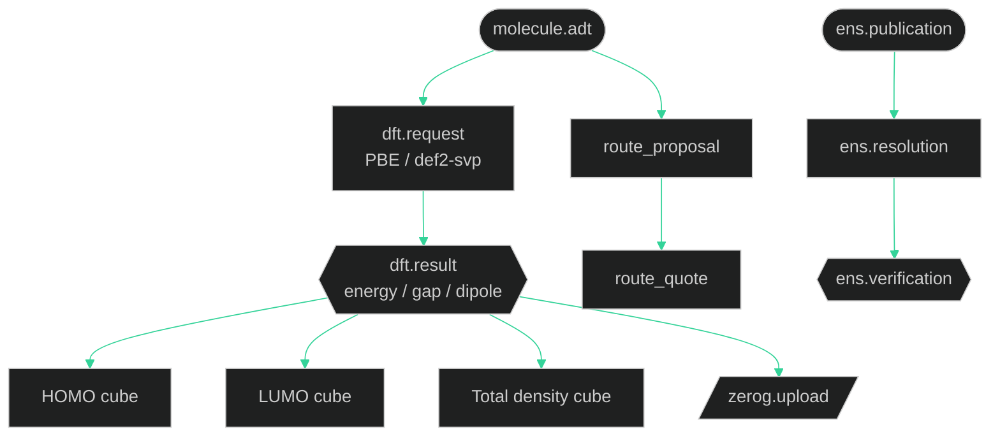
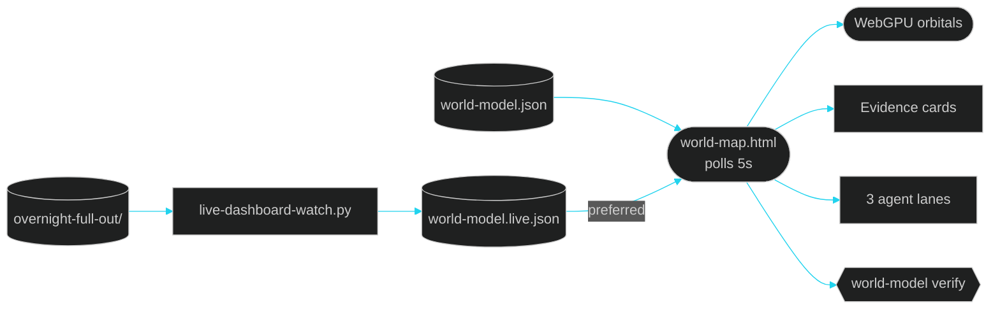
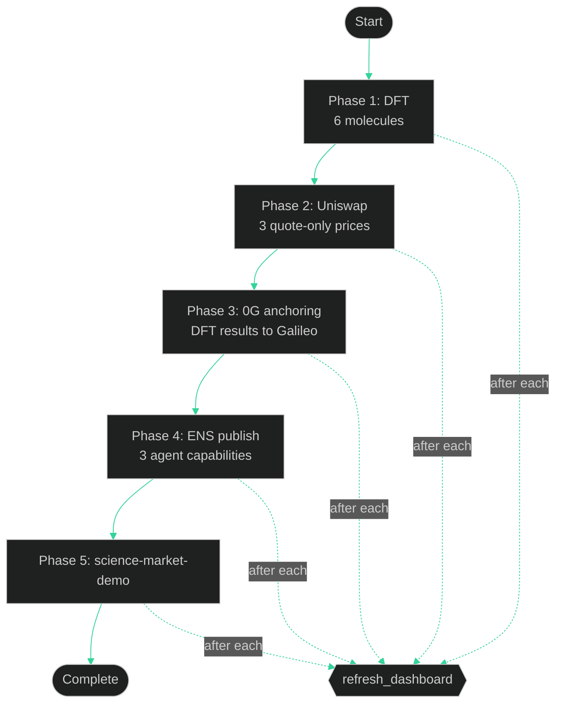
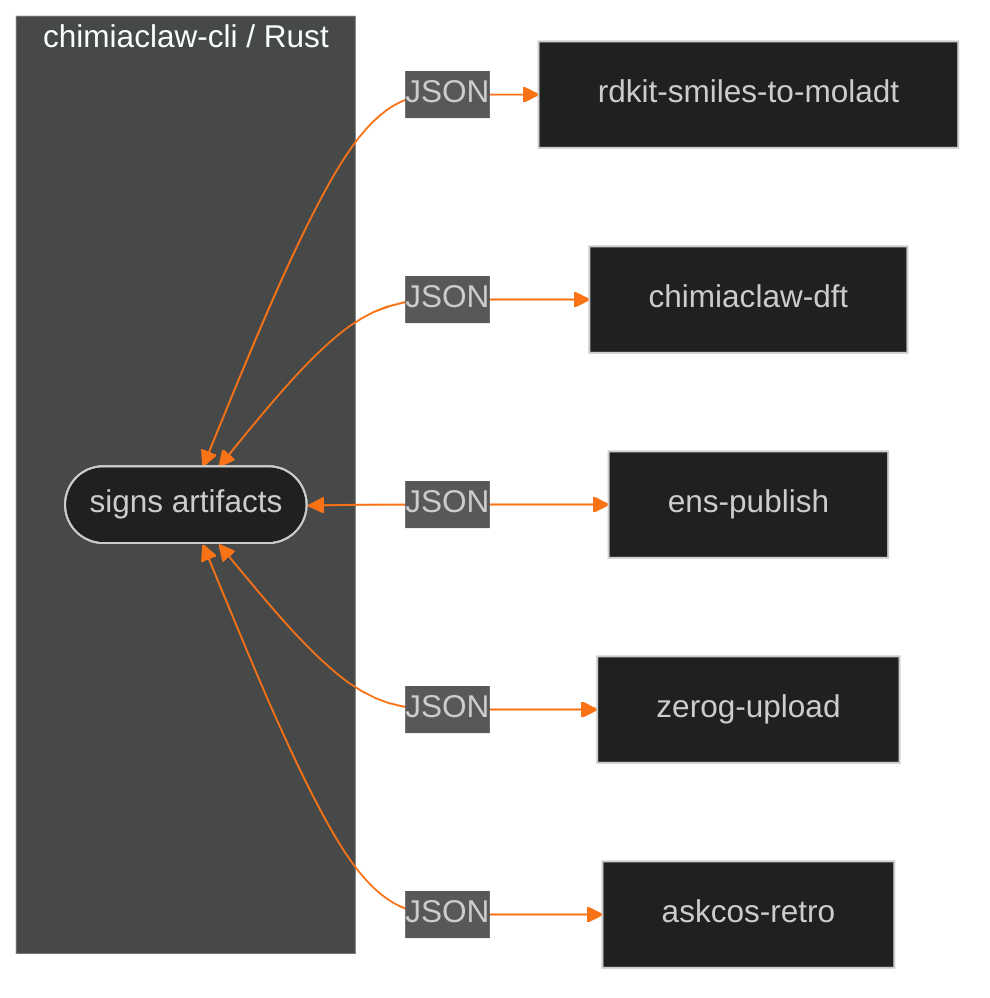

# ChimiaClaw system briefing

This document explains the entire ChimiaClaw / OpenAgents project to an agent that has never seen it. It is written so you can render diagrams, produce slides, or narrate a video from this context alone.

## One-sentence summary

ChimiaClaw is a Rust-native framework where every scientific action — DFT quantum chemistry, retrosynthesis, literature extraction — produces a signed, content-addressed artifact in a directed acyclic graph, with live ENS identity, 0G storage anchoring, and Uniswap quote-only settlement, all visible through a dependency-free auto-refreshing dashboard with a WebGPU orbital viewer.

## The core thesis



Every meaningful action becomes a signed artifact. Artifacts have Ed25519 signatures, Blake3 content hashes, parent lineage, schema tags, and payload bindings. Tamper with the payload, the signature breaks. This is the single source of truth — not a database, not a dashboard, not a chat log.

## The three-agent pipeline (submission surface)

The hackathon dashboard shows exactly three agent lanes connected in a loop:



### Agent 1: Literature (status: operator-gated-next)
- Not yet a completed extraction claim.
- Will sign `science.literature.synthesis` with citations, extracted reaction equations, confidence, and candidate molecules.
- The next signed run. Shown in the dashboard as the bridge between papers and executable chemistry.

### Agent 2: Retrosynthesis (status: implemented-local-skill)
- RetroQuoter produces signed `chem.retrosynth.route_proposal` and `chem.procurement.route_quote` artifacts.
- Implemented and demonstrable locally.

### Agent 3: DFT (status: real-execution)
- Real PySCF calculations produce signed `chem.dft.result` artifacts.
- **30+ real signed results** across four molecule families.
- Six cube-backed molecules have HOMO/LUMO/total-density `.cube` files committed by SHA-256.
- Five overnight germanium molecules have scalar energy/gap/dipole evidence only (no cubes).
- Six propylene-glycol-diester + germanium molecules from the full overnight pipeline.

## DFT evidence layers



**Critical boundary:** only cube-backed molecules appear in the WebGPU orbital gallery. Scalar-only runs are shown as evidence cards with energy/gap/dipole values. This is an evidence-integrity rule, not a UI limitation.

## The WebGPU orbital gallery

The dashboard's hero panel is a six-molecule interactive WebGPU renderer:

- Point sprites for HOMO (positive/negative phase colors) and LUMO orbitals
- Bond skeleton lines inferred from covalent-radii distance thresholds on cube-header atom coordinates
- Molecule tabs: water, methanol, benzene, propylene glycol, caprylic acid, capric acid
- Controls: Both / HOMO / LUMO / Pause, drag to rotate
- 5,200 HOMO + 5,200 LUMO sampled points per molecule
- Asset: `demo/dft/orbitals/homo_lumo_gallery_3d.json`
- No WebGL fallback — WebGPU only

The gallery is **derived evidence**. The source of truth is the signed `chem.dft.result` artifacts and their SHA-256 cube commitments.

## Sponsor integrations

```mermaid
%%{init: {'theme':'dark','themeVariables':{'primaryColor':'#3b82f6','primaryTextColor':'#fff','lineColor':'#60a5fa','secondaryColor':'#1e293b'}}}%%
flowchart TD
    subgraph ENS [ENS / Sepolia]
        direction LR
        E1[publication] --> E2[resolution] --> E3{{verified}}
    end
    subgraph ZG [0G Storage / Galileo]
        direction LR
        Z1[DFT result] --> Z2[zerog.upload] --> Z3{{anchored}}
    end
    subgraph UNI [Uniswap Trade API]
        direction LR
        U1[POST /v1/quote] --> U2{{signed quote}} --> U3[/NO SWAP/]
    end
    subgraph KH [KeeperHub]
        direction LR
        K1[workflow] --> K2[schedule] --> K3{{status}}
    end
```



### ENS
- Root `chimiaclaw.eth` on Sepolia: published, resolved, verified (3 signed artifacts).
- Per-agent capability records published for `dft.service`, `retro.service`, `literature.service`.
- Records resolved: 5/5, mismatches: 0.

### 0G Storage
- 12+ Galileo Turbo anchors across overnight DFT result artifacts.
- Each anchor is a signed `storage.zerog.upload` artifact.
- Private keys never touch process arguments.

### Uniswap
- `chimiaclaw-settle-uniswap` calls `POST /v1/quote` with CLASSIC routing (V2/V3/V4 pools).
- Seals the full response into a signed `market.uniswap.quote` artifact.
- Three price points: $3.10 (retro), $8.25 (DFT), $49.50 (batch).
- **Never calls `/swap`**. No fund movement without explicit operator confirmation.

### KeeperHub
- Rust REST client + reference manual-trigger workflow.
- Runbook-only for the submission.

## The science service market



Three service flows exist: retrosynthesis, DFT, and literature. Each has the full economic settlement lifecycle. Retro and DFT settle via `UniswapPreparedTransfer`; literature uses a simulated ledger.

## The artifact DAG



Every artifact has:
- `id`: `art_<hex>` unique identifier
- `skill`: which skill produced it
- `agent`: which agent signed it
- `schema_tags`: typed classification (e.g., `chem.dft.result`)
- `parent_artifact_ids`: lineage chain
- `payload`: `PayloadRef` with Blake3 hash binding
- `content_hash`: signs the payload binding
- `signature`: Ed25519 over the canonical bytes
- `created_at_unix`: timestamp

## The dashboard architecture



- The browser tries `world-model.live.json` first, falls back to `world-model.json`.
- Polls every 5 seconds with `cache: "no-store"`.
- The WebGPU viewer is only recreated when the orbital asset path changes (prevents constant teardown during polling).
- The dashboard **never** contacts wallets, APIs, or private services. It reads local JSON files only.

### Live dashboard watcher

`demo/live-dashboard-watch.py` is a dependency-free Python script that:
1. Scans `demo/overnight-full-out/dft/` for `chem_dft_result.art_*.json`
2. Scans `demo/overnight-full-out/uniswap/` for `market_uniswap_quote.art_*.json`
3. Scans `demo/overnight-full-out/zerog/` for `*.json` anchor artifacts
4. Scans `demo/overnight-full-out/ens/` for `identity_ens_*.json`
5. Decodes inline hex payloads from artifact JSON
6. Deduplicates DFT results by molecule (keeps latest per label)
7. Writes `demo/world-model.live.json` atomically via `.tmp` + `os.replace`

The full pipeline script (`demo/overnight-full-pipeline.sh`) calls the watcher after each phase.

## The overnight full pipeline



Each phase calls `refresh_dashboard()` after each attempt, so the browser dashboard updates as artifacts appear.

## Worker boundaries

All external Python skills attach via `CHIMIACLAW_*_COMMAND` environment variables pointing at uv projects. No Docker, no Homebrew, no in-process FFI.



Worker contract: read input on stdin or via flags → write JSON on stdout → exit non-zero with stderr on failure. The Rust adapter validates the schema before signing.

## MolADT: the molecule substrate

`chimiaclaw-moladt` defines the canonical molecule type: atoms with coordinates, formal charges, sigma bonds, Dietz bonding systems, provenance, and projection hints.

Three geometry tiers:
1. **schematic-curated** — hand-built library (water, benzene, etc.)
2. **geometry-guess-covalent-radii** — pure-Rust BFS embedder + spring relaxation
3. **rdkit-etkdgv3-mmff94** — real conformer + force-field from the RDKit worker

`provenance.source_kind` is always truthful so downstream agents never mistake a guess for a DFT-ready geometry.

## Repository structure

```
crates/
├── chimiaclaw-artifact        # Signed artifact model, store trait
├── chimiaclaw-schema          # Typed IDs, capabilities, schema tags
├── chimiaclaw-moladt          # Portable Molecular ADT
├── chimiaclaw-market          # Science service market
├── chimiaclaw-settle-uniswap  # Uniswap Trade API adapter
├── chimiaclaw-identity-ens    # ENS resolver + verifier
├── chimiaclaw-storage-0g      # 0G Storage adapter
├── chimiaclaw-dft-skala       # DFT worker adapter
├── chimiaclaw-node            # Local polling runtime
├── chimiaclaw-cli             # CLI entrypoint
├── chimiaclaw-crucible        # Peer review votes
└── (reactor, optimization, governance, ord-adt, etc.)

apps/
├── retroquoter                # Route quote engine
├── dft-daemon                 # DFT swarm scaffold
└── marchev-mssp               # Optimization scaffold

demo/
├── world-map.html             # Dashboard (2,500-line single file)
├── world-model.json           # Static model fixture
├── world-model.live.json      # Auto-generated live projection (gitignored)
├── live-dashboard-watch.py    # Watcher script
├── overnight-full-pipeline.sh # Full 5-phase pipeline
├── overnight-full-out/        # Pipeline output artifacts
├── overnight-science-out/     # Earlier scalar DFT batch
├── dft/                       # Cube-backed DFT gallery
│   ├── cubes/                 # 18 Gaussian .cube files
│   └── orbitals/              # WebGPU gallery JSON
├── ens-out/                   # ENS roundtrip artifacts
├── zerog-out/                 # 0G anchor artifacts
└── uniswap/                   # Uniswap quote artifacts

contracts/
├── src/ArtifactAnchor.sol     # On-chain artifact anchoring
└── src/SettlementEscrow.sol   # Artifact-bound payment intents

skills/scienceclaw-port/workers/
├── cheminformatics/           # RDKit SMILES→MolADT
├── dft/                       # PySCF DFT worker
├── identity-ens/              # ENS publication worker
├── retrosynth/                # ASKCOS retrosynthesis
└── storage-0g/                # 0G upload wrapper
```

## Validation commands

```sh
# Preflight
cargo fmt --all -- --check
cargo check --workspace
cargo test --workspace
cargo check --workspace --all-features

# Dashboard integrity
python3 -m py_compile demo/live-dashboard-watch.py
python3 demo/live-dashboard-watch.py --once
python3 -m json.tool demo/world-model.json > /dev/null
python3 -m json.tool demo/world-model.live.json > /dev/null

# Extract and check dashboard JavaScript
python3 -c "
from pathlib import Path
html = Path('demo/world-map.html').read_text()
start = html.index('<script>') + len('<script>')
end = html.index('</script>', start)
Path('/tmp/chimiaclaw-world-map-script.js').write_text(html[start:end])
"
node --check /tmp/chimiaclaw-world-map-script.js

# Artifact verification
cargo run -p chimiaclaw-cli -- world-model verify \
  --world-model demo/world-model.json --artifact-dir demo
cargo run -p chimiaclaw-cli -- world-model verify \
  --world-model demo/world-model.live.json --artifact-dir demo
```

Latest results: static model verified 12/12 references, live model verified 51–73 references (depends on pipeline state), all tests pass.

## Key evidence numbers

- **14** signed `chem.dft.result` artifacts in the static model
- **6** cube-backed molecules in the WebGPU orbital gallery
- **18** Gaussian `.cube` files under `demo/dft/cubes/`
- **5** scalar-only overnight germanium molecules
- **6** full-pipeline DFT molecules (propylene glycol diesters + germanium)
- **3** Uniswap quote-only settlement artifacts
- **12** 0G Galileo Turbo storage anchors
- **9** ENS publication/resolution/verification artifacts
- **3** agent lanes, **3** handoffs, **3** agent-run cards

## What is NOT claimed

- Literature lane has no completed extraction artifact yet.
- No `/swap` execution — Uniswap is quote-only.
- 0G anchors prove the storage path, not that every payload is uploaded.
- ENS proves root identity + per-agent capabilities, not autonomous behavior.
- The WebGPU gallery is derived visualization, not source evidence.
- Scalar-only DFT runs do not have cubes and must not be shown as orbital tabs.
- KeeperHub is runbook-only.
- AXL cross-node transport is adapter-shape-only.
- Governance/DAO execution is scaffolded, not enforced.

## Rendering guidance for diagram agents

If you are rendering diagrams from this briefing:

1. **The three-agent loop** is the most important diagram. Literature → Retrosynthesis → DFT → back to Literature. This is the submission story.

2. **The DFT evidence layers** diagram shows the three tiers (cube-backed gallery, scalar germanium, live pipeline) and why they are kept separate.

3. **The sponsor integration** diagram shows ENS, 0G, Uniswap, and KeeperHub as four independent attachment points, not as a linear chain.

4. **The dashboard architecture** diagram shows the static/live model fallback and the watcher pipeline.

5. **The artifact DAG** diagram shows how MolADT → DFT request → DFT result → cube commitments form a verifiable lineage.

6. **The service market** diagram shows the full economic settlement lifecycle.

Use dark backgrounds (oklch 0.07–0.10 range), cyan/teal for primary accents, green for real-execution evidence, amber for operator-gated items, and purple for concept/design-only elements. This matches the dashboard aesthetic.
